# Overview

**TextPaint** is not designed to use as plain text editor, there is designed to create or modify text as a simple graphic or scheme using ANSI or Unicode characters\. You can create texts such as organizational charts, simple circuit schemes, algorithm flow, tables, to use it where destination medium supports text printed using fixed\-width font\.

The text can be both monochrome saved as plain text or color saved as text with ANSI escape commands\. You can view or edit many existing ASCII\-art or ANSI\-art files\.

This application works in system console, but it can also work as graphical window, which simulates the console\. You can resize the console or window, but application will be repainted after pressing any key\. Application will not be repainted after resizing while the character selector is shown, but the application will be repainted after closing the character table and pressing any key\.

**TextPaint** also provides simple cipher, which user Vigenere algorithm\. You can encipher some text fragments using password\.

## Other functions

**TextPaint** has other function than text editor, called as work modes\. Other work modes uses the same ANSI interpreter and was implemented to test various cases\.

There are available following work modes, choosen by **WorkMode** parameter:


* **WorkMode=0** \- Text editor, the main purpose of **TestPaint**, which is described in **Readme\.md** file\.
* **WorkMode=1** \- ANSI viewer with progressive printing and server\. This mode can be used to view animation created by progressive placing characters and is described in **Readme\_ANSI\.md** file\.
* **WorkMode=2** \- Telnet or SSH client, which is parially compatible with VT100, ANSI and derivative terminal emulators\. Details about this mode are described in **Readme\_ANSI\.md** file\.
* **WorkMode=3** \- Encoding list display and keycode test\. The only purpose is displaying supported encoding list and code/name of every pressed key, which is needed to implement additional functions and test the **TextPaint** in various platforms\. This mode is described in **Readme\_keys\.md** file\.
* **WorkMode=4** \- Non\-interactive simple command line application, without any interface:
  * Render text into bitmap image detailed in **Readme\_render\.md** file\.
  * Convert XBIN or BIN file to ANSI text file\.
  * Save to files all available 1\-byte encodings\.

## Two editions

TextPaint exists in two editions:


* \.NET Framework \- compatible with \.NET 4\.5, uses Windows Forms as graphical user interface\.
* \.NET Core \- compatible with \.NET 6\.0, uses Avalonia as graphical user interface\.

Both editions have identical functionality, but can have some subtle differences like following:


* Available \.NET built\-in text encodings\.
* Bell sound availability\.
* Interaction with system clipboard\.
* Fullscreen window display\.

# Application running

For the \.NET Framework edition, input file name as command line parameter\. If you not give parameter or give blank file name, the **Config\.txt** file will be opened to allow editing the configuration file\.

```
TextPaint.exe FileNameWithPath.txt [parameters]
```

If you use **Mono** project \(required in Linux\), you can run application with this command:

```
mono TextPaint.exe FileNameWithPath.txt [parameters]
```

The \.NET Core edition can be run on Windows and Linux by the command:

```
dotnet TextPaint.dll FileNameWithPath.txt [parameters]
```

In the further document text, there will be uset the `TextPaint` as application file name\.

You can also override configuration options, which can be used in **Config\.txt** file\. From second parameter, application accepts configuration parameters profided with **=** character\. For example, to force running in 40x15 window, run this command:

```
TextPaint FileNameWithPath.txt WinUse=2 WinW=40 WinH=15
```

In work mode 3, in place of file name, you have to provide server address with port\. if the port equals to 23, it can be ommited\.

```
TextPaint 192.168.1.100:23 WorkMode=3
```

All options are described in **Configuration file** chapter\.

## Application files and directories

**TextPaint** is supplied with the following files and directories:


* **Samples** \- Sample text files\.
* **Fonts** \- Bitmap fonts\.
* **Config\.txt** \- Main configuration file\.
* **Fav\.txt** \- Favorite character definitions\.
* **Info\.txt** \- Context information\.
* **TextPaint\.exe** or **TextPaint\.dll** \- Application binary executable\.
* Libraries needed to run the **TextPaint**\.

# Functionality and interface

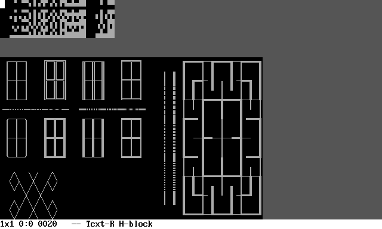

TextPaint can work in one of the 4 states\. The default state is **state 1**\. In all states, you can use these keys:


* **Arrows** \- Move cursor horizontally or vertically\.
* **Home, End, PageUp**, **PageDown** \- Move cursor diagonally\.
* **Tab** \- Change cursor visualization type, one of four modes\. This function may help to match writing/drawing to other objects\.
* **F1** \- Switch to **state 1** \(edit text\) or show information about **state 1**\.
* **F2** \- Switch to **state 2** \(edit characters\) or show information about **state 2**\.
* **F3** \- Switch to **state 3** \(character paint\) or show information about **state 3**\.
* **F4** \- Switch to **state 4** \(pixel paint\) or show information about **state 4**\.
* **F7** \- Save file\. If the cipher is enabled, you will have to input cipher password twice\. If password is not the same, you will have to input password one more time\.
* **F8** \- Reload file\. If the cipher is enabled, you will have to input cipher password used to save the file\.
* **F9** \- Open character selection to draw\.
* **F12** \- Quit TextPaint\.
* **Z** \- Undo \(not works in **state 1** and **state 2**\)\.
* **X** \- Redo \(not works in **state 1** and **state 2**\)\.

To undo or redo editing text or characters \(**state 1** or **state 2**\), you can undo/redy by following procedure:


1. Switch temporarily to **state 2** or **state 3**\.
2. Press **Z** or **X** key to undo or redo\.
3. Switch back to **state 0** or **state 1**\.

The other available keys depends on the current working state\. The unnecessary spaces and lines are automatically trimmed during editing\. You can write on the grey aread, then necessary lines or spaces will be added automatically\.

The colors are following:


* **White text on black background** \- Actual text\.
* **Dark gray** \- Space beyond end of line\.
* **Bright gray** \- Space below the last line\.
* **Black text in white background** \- Status bar\.

## Context information

When you press the **F1**, **F2**, **F3**, **F4** key one more time, after switchint to the state, there will be displayed short information about selected state\. Use arrow keys to scroll the text\.

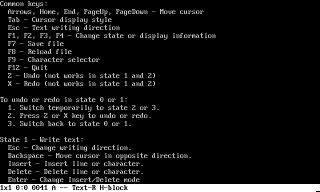

To close information, press **Esc** or any **F** key \(**F1**\-**F12**\)\. The informations are read from the **Info\.txt** file\.

## Status bar

At the bottom of console window, there is the status bar, with black text on white background\. The status bar in **state 1**, **state 2** and **state 3** has the following informations from left to right:


1. Font and cursor size \(width and height\)\.
2. Cursor position \(row and column\)\. The character between numbers indicated current text area:
   * **Colon** \- All cells of the cursor are inside some text line\.
   * **Semicolon** \- At least one cursor cell is beyond end of text line, but all cursor cells are not below the last line\.
   * **Comma** \- At least one cell of the cursor is below the last line of text\.
3. Character number and glyph under the most cursor cells\.
4. Number of background and foreground color under the most cursor cells, the hyphen indicates, that color is not defined \(used default\)\.
5. State indicator:
   * **Text** \- Write text \(**state 1**\), followed by direction indicator:
     * **R** \- **Right** \- From left to right\.
     * **RD** \- **Right/Down** \- From up\-left to down\-right\.
     * **D** \- **Down** \- From up to down\.
     * **DL** \- **Down/Left** \- From up\-right to down\-left\.
     * **L** \- **Left** \- From right to left\.
     * **LU** \- **Left/Up** \- From down\-right to up\-left\.
     * **U** \- **Up** \- From down to up\.
     * **UR** \- **Up/Right** \- From down\-left to up\-right\.
   * **Char** \- Write character \(**state 2**\), followed by direction indicator the same as in the **state 1**\.
   * **Rect** \- Character drawing \(**state 3**\), rectangle shape\.
   * **Dia** \- Character drawing \(**state 3**\), diamond shape\.
6. Elements in **state 3** only:
   1. Shape size\.
   2. Character set used to draw figure in **state 3**:
      * Single character: Character code and glyph\.
      * Character set: Name defined in **Config\.txt** file\.
7. Insert/delete mode:
   1. **H\-block** \- Insert or delete text inside one line, at right from the cursor \- moves text horizontally\.
   2. **V\-block** \- Insert or delete text inside one column, below the cursor \- moves text vertically\.
   3. **H\-line** \- Insert or delete columns \- moves text horizontally\.
   4. **V\-line** \- Insert or delete rows \- moves text vertically\.
   5. **H\-roll** \- Roll the text horizontally \- combine of insertion and deletion by font width, works on the **state 3** only and when the rectangle width is greater than 1\.
   6. **V\-roll** \- Roll the text vertically \- combine of insertion and deletion by font height, works on the **state 3** only and when the rectangle height is greater than 1\.

The status bar in **state 4** has different layout, which is described in subchapter about **state 4**\.

# Character and color selector

**TextPaint** has two similar selectors\. In order to enter into selector, press **F9** key and switch between selectors by pressing **F3** key\.

## Character selector

In the **state 3** and **state 4**, you can draw using selected character\. The current drawing character and character code is shown on the status bar when the character is used to draw\. In the **state 1**, **state 2** and **state 3**, if you insert space \(in mode **H\-block** and **V\-block** only\), the selected character will be inserted\. You can invoke the character selector in every state by pressing the **F9** key\.

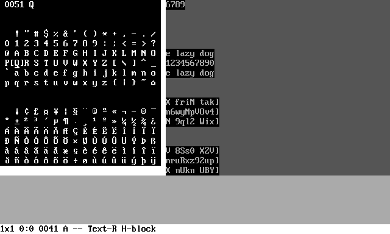

At the top of character table there will be display the character hexadecimal code and character glyph\. The code consists of 4 or 5 digits\. The plane 16 forces code length to be 6 digits, but is used very rarely, so the leading **10** digits for plane 16 is replaced by **G** to get 5\-digital code\. The **G** digit is outside of hexadecimal digit set and means 16\. For example, the **G1234** has the same meaning as **101234**\.

The character selector can work in two states:


* **Ordinary** \- Browse all characters\. By default, browsing the pages is limited, but the limit can be enabled and disabled by pressing **F4** key\. The limit depends on work conditions:
  * When window is used \(**WinUse=1** or **WinUse=2**\) and there is used bitmap font: The pages, which are drawn in font graphics file\.
  * Otherwise: The pages with characters outside of range from **D800** to **DF00**\. The characters within this range are not regular characters and can not be rendered in most cases\.
* **Favorite** \- The 256 places of favorite characters, 95 of them can be assigned to alphanumeric keys\.

You can use the following keys while the character table is shown:


* **Arrows** \- Select character on the current page\. You can go beyond the current page range to switch the page\.
* **Page up**, **Page down** \- Flip one page up or down \(go ahead 256 characters\)\.
* **Home**, **End** \- Flip 16 pages up or down \(go ahead 4096 characters\)\.
* **F1**, **F2** \- Switch the plane \(go ahead 65536 characters\)\.
* **F3** \- Switch to **color selector**\.
* **F4** \- Browsing all pages, including invisible \(character selector state\)\. This function allows to browse through all pages even, when you loaded bitmap font and the font does not include characters for all pages\.
* **Insert** \- Switch between ordinary and favorite state:
  * **Ordinary**: If the pinted character exists in favorite set, there will be pointed\.
  * **Favorite**: There will be pointed the same character, which is pointed in favorite state\.
* **Delete** \- Go to character being under the cursor\.
* **Backspace**:
  * **Ordinary**: Select character for save as favorite\.
  * **Favorite**: Select character or put character on pointed place\.
* **Tab** \- Move character selector window from corner to corner\. You can use this if the window covers some text or window is bigger than screen\.
* **Esc** \- Close without changing selected character\.
* **Enter** \- Change selected character and close\.
* **Any alphanumeric key**:
  * **Ordinary**: Save pointed character as favorite under pressed key\.
  * **Favorite**: Go to place assigned with pressed key\.

## Color selector

You can turn character selector into color selector or turn color selector into character chelector by pressing **F3**\. In color selector, you can select the color and input text mode\. The text and colors are treated as two independed layers, which can be modifed simultaneously or separately\.

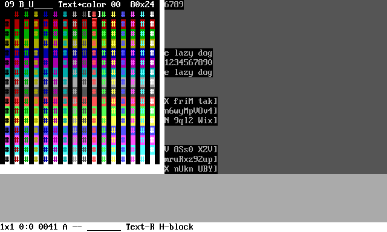

While the color selector is showm, you can use the following keys:


* **Up arrow**, **Down arrow** \- Select background color\.
* **Left arrow**, **Right arrow** \- Select foreground color\.
* **Page up**, **Page down** \- Number of columns for ANSI file load\. Use if file is loaded incorrectly, applicable when **ANSIRead=1**\. Value 0 means unlimited\.
* **Home**, **End** \- Number of rows for ANSI file load\. Use if file is loaded incorrectly, applicable when **ANSIRead=1**\. Value 0 means unlimited\.
* **F1** \- Switch between CR character processing while loading file, when when **ANSIRead=1**:
  * **0** \- Treat as CR character \(default\)\.
  * **1** \- Treat as CR\+LF sequence\.
  * **2** \- Ignore CR character\.
* **F2** \- Switch between LF character processing while loading file, when when **ANSIRead=1**:
  * **0** \- Treat as LF character \(default\)\.
  * **1** \- Treat as CR\+LF sequence\.
  * **2** \- Ignore LF character\.
* **F3** \- Switch to **character selector**\.
* **Insert** \- Switch between edit mode within three states:
  * **Text \+ color** \- Edit text and color simultaneously\.
  * **Text** \- Edit text only without color changing\.
  * **Color** \- Edit color only without text changing\.
* **Delete** \- Go to color being under the cursor\.
* **Tab** \- Move color selector window from corner to corner\. You can use this if the window covers some text or window is bigger than screen\.
* **Esc** \- Close without changing selected color\.
* **Enter** \- Change selected color and close\.

You can change text without changing colors or colors without changing the text\. In order to do, switch to appropriate mode using **Insert** key\. The text and colors are independed layes\.

## ANSI file loading

Many ANSI files are prepared for specified number of columns, in most cases for 80 columns and unlimited number of rows\. If you set other number of columns or use unlimited number of columns \(**ANSIWidth=0**\), the file may be loaded incorrectly\. To correct this, enter into color selector, change number of columns or rows using **Page up**, **Page down**, **Home** or **End** keys and press **Enter** key\. Then, you have to reload file using **F8** keys\.

Sometimes, the number of rows can also be specified for particular file and the file can be loaded incorrectly, when number of rows are unlimited\. The most popular numbers of rows in such case are **24** and **25**\.

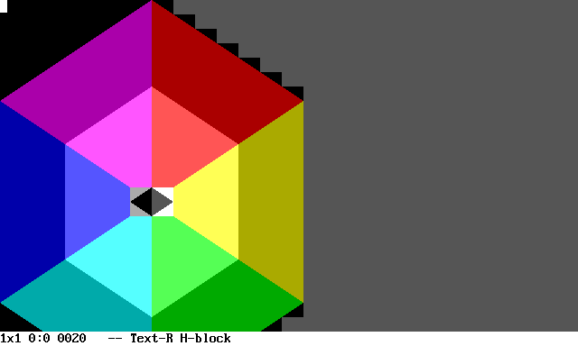

If there file loaded with **ANSIRead=1** is actually plain text file, the file can contain different end\-of\-line character\. If the file is loaded incorrectly, you can change parsing of CR \(**0Dh**\) and LF \(**0Ah**\) character in color selector\. You can press **F1** or **F2** during color selector to change way of the character processing, the current state is diaplayed as two digits on the top of character selector\. Example settings:


* **00** \- Standard process of CR and LF characters, suitable for all ANSI files and text files using CR\+LF like files created in DOS and Windows\.
* **21** \- Use LF character as CR\+LF \(EOL\), suitable for plain text files created on Unix and Linux, which uses LF as EOL\.
* **12** \- Use CR character as CR\+LF \(EOL\), suitable for plain text files created on systems, which uses CR as EOL\.
* **11** \- Use every CR character and every LF character as EOL separately\.

# Work states

**TextPaint** in work mode 0 works in one of 4 states, which you can swich by pressing **F1**, **F2**, **F3**, or **F4** key\. In order to display help text about keys available in the current state, press the same function key again\. For example, in order to get help about state 2, press **F2** while applicationworks in state 2\.

## State 1 \- Write text

In the **state 1**, you can input alphanumeric characters like in every standard text editor, but there are few differences\.

You can use the following functional keys:


* **Esc** \- Change writing direction\.
* **Backspace** \- Move cursor in opposite direction \(this not delete the char\)\.
* **Insert** \- Insert line or character\.
* **Delete** \- Delete line or character\.
* **Enter** \- Change Insert/Delete mode\.

### Undo and redo

You can undo or redo writing, but the direct function not exists\. To undo or redo, you have to switch to **state 3** or **state 4** by pressing **F3** or **F4**\. Then, you can undo or redo by pressing **Z** or **X**\. After undo or redo, you can return to **state 1** by pressing **F1**\.

### Insert and delete

The **Enter**, **Insert** and **Delete** keys has different function than standard text editor\.

By pressing **Enter**, you can choose between four insert/delete modes:


* **H\-block** \- Insert or delete text inside one line, at right from the cursor \- moves text horizontally\.
* **V\-block** \- Insert or delete text inside one column, below the cursor \- moves text vertically\.
* **H\-line** \- Insert or delete columns \- moves text horizontally\.
* **V\-line** \- Insert or delete rows \- moves text vertically\.
* **H\-roll** \- Roll the text horizontally \- combine of insertion and deletion by font width, works on the **state 3** only and when the rectangle width is greater than 1\.
* **V\-roll** \- Roll the text vertically \- combine of insertion and deletion by font height, works on the **state 3** only and when the rectangle height is greater than 1\.

## State 2 \- Write characters

**State 2** works exactly by the same way as **state 1** with one difference: If you press alphanumeric key, there will be written favorite characters assignet to the keys instead of ordinary characters\. You can view and change the assigment in character selector\.

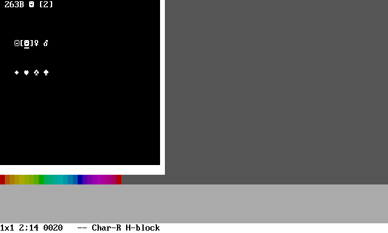

The state is most usable when you frequently write specified characters, because you can write the character just by pressing assigned key\.

## State 3 \- Character drawing

**State 3** is intended to the following actions:


* Draw line using frame characters\.
* Undo and redo\.
* Draw the rectangle or diamond on the selected place without painting line manually\.
* Copy and paste text\.
* Manually write frame elements\.
* Insert or delete larger portion of spaces\.
* Change font size\.

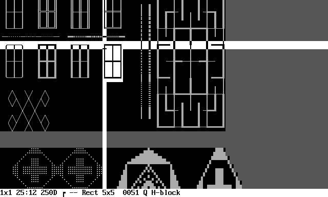

In the **state 3**, you have the following functions available:


* **W**,**S**,**A**,**D** \- Change figure size\.
* **Q**,**E** \- Change cursor position within the rectangle or diamond\.
  * **Q** \- Move counter clockwise\.
  * **E** \- Move clockwise\.
* **1** \- Change figure shape one of 9\.
* **2** \- Change character set\.
* **3** \- Draw hollow frame\.
* **4** \- Draw filled frame\.
* **5** \- Start or stop drawing line by moving cursor\.
* **6,7** \- Font width\.
* **8,9** \- Font height\.
* **C** \- Copy the text being inside the figure\.
* **V** \- Paste the text into the area inside the figure\.
* **Insert** \- Insert line or character \(works on rectangle shape only\)\.
* **Delete** \- Delete line or character \(works on rectangle shape only\)\.
* **Enter** \- Change Insert/Delete mode\.
* **I** or **Numpad Plus** \- Write vertical line\.
* **K** or **Numpad Minus** \- Write horizontal line\.
* **Space** or **Numpad 0** \- Write selected character\.

### Writing frame elements

Apart from keys listed above, you can write frame elements \(corners, tees and crosses\) using some letter keys and numpad digits as in the following scheme:

```
  T---Y---U         T         7---8---9         7
  |   |   |        / \        |   |   |        / \
  |   |   |       G   Y       |   |   |       4   8
  |   |   |      / \ / \      |   |   |      / \ / \
  G---H---J     B   H   U     4---5---6     1   5   9
  |   |   |      \ / \ /      |   |   |      \ / \ /
  |   |   |       N   J       |   |   |       2   6
  |   |   |        \ /        |   |   |        \ /
  B---N---M         M         1---2---3         3
```

For example, the **T** key or **Numpad 7** writes the upper left corner as shown above\. The diamond shape is treated as rectangle rotated clockwise\.

### Insert and delete

The insert and delete function works by the same way as in **state 1** and **state 2**, but there is few differences:


* This function works only, when rectangle shape is selected
* In **H\-block** and **H\-line** modes, the rectangle width determines number of inserted or deleted columns once\.
* In **V\-block** and **V\-line** modes, the rectangle height determines number of inserted or deleted columns once\.
* In **H\-block** mode, there can be modified few rows according to rectangle height\.
* In **V\-block** mode, there can be modified few columns according to rectangle width\.
* The **H\-roll** and **V\-roll** modes works in the **state 3** only and while the rectangle width \(for **H\-roll**\) or the rectangle height \(for **V\-roll**\) is greater then 1\.

### Font size

**State 3** is the only state, which allows to change font and cursor size, which will be applied for all states\. The font width and height can be adjusted separately, between 1 and 32 cells\. The cursor size represents the current font size and the size is indicated on the status bar\. The move step is the same as current font width or height\. To move cursor over another distance, change the font size\.

If you change font size whice the cursor is not at the first line and the first column, it is possible, it is possible, that the cursor distance from begining does not equal to multiply font width or height\. In such case, when you move the cursor left or up, the first column or the first row will not reachable, because the remaining distance is less than font size\. Cursor position above the first row or before the first column is not possible\.

While the font width or height is greater than 1, the current character or color indicated on the status bar and used in some operation is determined be the most number of cells containing such character or color\. If there are several characters in the same number of cells within the cursor, the first occurence will be used\.

You can copy and paste the text preserving the font size only when the font size is 1x1 while both copying and pasting\. When you copy or paste with other font size, the text and color will be preserved\. Otherwise, you can copy the text written with the bigger font into the other software or paste the text from the other software using desired font size\.

## State 4 \- Pixel drawing

The **state 4** is purposed to draw pictures using semigraphical characters splitted into pixels\. Some characters offers pixels by splitting for example to 2x2 pixels per character\. You can paint by character or by pixels as defined in configuration file\. In the state, there are two cursors:


* **Main cursor** \- The cursor, which is moved by **Arrow** keys and **Home**/**End**/**PageUp**/**PageDown** keys\. Pressing these keys causes movement of both cursors\.
* **Size cursor** \- The second cursor, which is connected with main cursor\. This cursor determines figure size for drawing lines, rectangles, ellipses, and copying/pasting picture\.

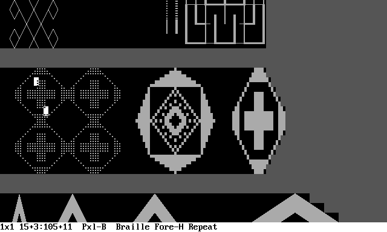

During **state 4**, there are following functions by keys:


* **W**,**S**,**A**,**D** \- Move size cursor\.
* **I**,**K**,**J**,**L** \- Move picture between cursors\.
* **1** \- Change paint configuration:
  * The first configuration uses one pixel per character and allows to select character for foreground and background in character selector\.
  * The other configurations are defined in **Config\.txt** file and may use several pixels per character\. Every pixel configuration inside character is mapped to appropriate character\.
* **2** \- Change default color\. This option defines, how will be treated characters other than characters used in current paint configuration\.
* **3** \- Draw one pixel \(in hollow mode\) or flood fill \(in fill mode\)\.
* **4** \- Draw line between cursors\.
* **5** \- Draw rectangle between cursors\.
* **6** \- Draw ellipse between cursors\.
* **P** \- Turn pencil on/off\.
* **M** \- Change picture move mode\. The mode is used while moving using **I**,**K**,**J**,**L** keys:
  * **Repeat** \- The edge of moved picture will be repeated\.
  * **Roll** \- The edge will be fillled with edge from the other side of moved picture\.
  * **Background** \- The edge will be filled with background color\.
  * **Foreground** \- The edge will be filled with foreground color\.
  * **Flip/Rotate** \- Flip or rotate instead of movement\. Use keys as following:
    * **I** \- Flip vertically\.
    * **K** \- Flip horizontally\.
    * **J** \- Rotate counter clockwise \- works only when width equals to height\.
    * **L** \- Rotate clockwise \- works only when width equals to height\.
* **N** \- Invert colors between cursors\.
* **C** \- Copy picture between cursors as text to clipboard\. This function uses characters selected as foreground and background color in first paint configuration\.
* **V** \- Paste picture between cursors from flipboard\. The clipboard bust contain text using characters selected as foreground and background color in first paint configuration\.
* **Q**,**E** \- Move cursors around rectangle corners determined by this cursors:
  * **Q** \- Move counter clockwise\.
  * **E** \- Move clockwise\.
* **R** \- Change paint color wrom there options:
  * **Background** \- Use background color\.
  * **Foreground** \- Use foreground color\.
  * **Negative** \- Changes to opposite color while drawing\.
* **F** \- Change paint fill option for drawing pixels, rectangles and ellipses:
  * **Hollow** \- Draw pixels and hollow figured\.
  * **Fill** \- Draw floodfill and filled figures\.

### Status bar

In **state 4**, the status bar has different layout, described from left to right:


1. Font and cursor size \(width and height\)\.
2. Canvas cursor position and size in pixels\. The size sign \(plus or minus\) indicates direction from main cursor to size cursor\.
3. The **state 4** indicator with default color and pencil state:
   * **Pxl\-B** \- The default color is background, pencil is off\.
   * **Pxl\-F** \- The default color is foreground, pencil is off\.
   * **Pxl\-B\*** \- The default color is background, pencil is on\.
   * **Pxl\-F\*** \- The default color is foreground, pencil is on\.
4. The paint configuration:
   * The first configuration \(one pixel per character\) is indicated by codes of used characters, separated by slash\.
   * The other configurations are indicated by configuration name defined in **Config\.txt**\.
5. Drawing color and fill mode:
   1. **Fore\-H** \- Foreground color, hollow\.
   2. **Back\-H** \- Background color, hollow\.
   3. **Nega\-H** \- Negative color, hollow\.
   4. **Fore\-F** \- Foreground color, fill\.
   5. **Back\-F** \- Background color, fill\.
   6. **Nega\-F** \- Negative color, fill\.
6. Picture move mode:
   1. **Repeat** \- The edge of moved picture will be repeated\.
   2. **Roll** \- The edge will be fillled with edge from the other side of moved picture\.
   3. **Back** \- The edge will be filled with background color\.
   4. **Fore** \- The edge will be filled with foreground color\.
   5. **FlipRot** \- Flip or rotate instead of movement\.

### Cursor display

Console can display cursor over the character, not over the pixel\. If you select configuration with pixels smaller than character, you will move pixel by pixel, when you press cursor keys\. The visible cursor will by over this character, which contains pointed pixel\. To point a specified pixel, you have to observe the position on status bar or count movement from last visible cursor movement\.

To check position, you can draw pixel or other figure \(key **3**, **4**, **5**, **6**\) and undo the drawing by pressing **Z**\.

# Configuration file

In the TextPaint directory there is the **Config\.txt** file, which allows to configure the application\. If you run TextPaint without parameters, this file will be open\. The configuration is read in the application run moment\. This file is organized as the **parameter=value** convention\. The blank lines, lines without **=** character and parameters other than listed below are ignored:


* **WinUse** \- Use window instead of console\. In certain systems and console configurations, some of unicode characters are not correctly rendered in the console\. If **WinUse** is set to **1** or **2**, the TextPain will work in the graphical window and all unicode characters should be rendered correctly\. The application usage is the same as in the console\. There are allowed the following values:
  * **0** \- Use console, not recommended in cases, while there is possible to use **WinUse=1** or **WinUse=2**\.
  * **1** \- Use window with standard image rendering control, recommended value\.
  * **2** \- Use window with non\-standard image rendering control \(only \.NET Framework version, on \.NET Core edition is the same as **WinUse=1**\)\. Use this setting only if interface picture is not displayed or crashed when you use **WinUse=1**\.
* **WorkMode** \- Work mode of TextPaint:
  * **0** \- Text editor \- the fundamental mode and purpose of **TextPaint**\.
  * **1** \- ANSI viewer and file server \- described in **Readme\_ANSI\.md** file\.
  * **2** \- Telnet/SSH client \- described in **Readme\_ANSI\.md** file\.
  * **3** \- Encoding list and keycode test \- described in **Readme\_keys\.md** file\.
  * **4** \- Render text file or ANSI file into image or movie \- described in **Readme\_render\.md** file\.
* **Bell** \- Bell sound type \(working may depend on operating system and console visibility, regardless of **WinUse** value\), usable in **WorkMode=1** and **WorkMode=2**:
  * **0** \- No bell\.
  * **1** \- Use console beep function\.
  * **2** \- Sound by writing bell character into console\.
* **Space** \- Characters \(hexadecimal numbers\), which will be treated as space\. The first character in the list is used as character being outside actual text\.
* **FileReadEncoding** \- Encoding used in file reading, in most cases, it should be **FileReadEncoding=utf\-8**\. You can display all supported encodings using **WorkMode=3**\.
* **FileWriteEncoding** \- Encoding used in file writing, in most cases, it should be **FileWriteEncoding=utf\-8**\. You can display all supported encodings using **WorkMode=3**\.
* **FileReadSteps** \- If provided greater than **0**, there is number of first steps \(not bytes and not characters, especially in VTxxx files\), which will be read from file, it is useful, when you want to create text/picture based on ANSI animation\. The parameter works only in **WorkMode=0**\.
* **Frame1\_x** \- Character set for rectangle frame, the **x** is the number of set, starting from 0\. The value consists of 12 items separated by comma\.
  * The first item is the set name\.
  * The other items are the hexadecimal character codes, which are the frame elements\.
* **Frame2\_x** \- Character set for diamond frame\. It works like **Frame1\_x**\.
* **Pixel\_x** \- Name and pixels per character definition number **x** for **state 4**\. The first must be **Pixel\_1**\. The parameters has three values separated by comma:
  * Configuration name\.
  * Horizontal pixels per character\.
  * Vertical pixels per character\.
* **Pixel\_x\_y** \- Character list fragment for fumber **x**\. For example, the first character list for definition number 2 is defined by parameter **Pixel\_2\_1**\. The number of coder per one fragment and number of fragments are not important\. Only the total number of character codes are important and must be equal to 2 powered to number of pixels per character\. For example:
  * 2 x 2 pixels per character \- 16 characters\.
  * 2 x 3 pixels per character \- 64 characters\.

## Appearance settings

The settings affect the appearance of interface:


* **ColorNormal** \- Color of default background and foreground in all work modes\.
* **ColorBeyondLine** \- Color of background indicating area beyond end of line, but not below the last line\.
* **ColorBeyondEnd** \- Color of background indicatin area below the last line\.
* **ColorCursor** \- Color of text cursor with guide lines in **WorkMode=0**\.
* **ColorStatus** \- Color of status bar in **WorkMode=0** and **WorkMode=1**\.
* **ColorPopup** \- Color of character selector and color selector in **WorkMode=0**, color of information window in **WorkMode=2**\.
* **BeyondLineColumn** \- Number of columns, which will be displayed using **ColorNormal** instead of **ColorBeyondLine** regardless being beyond of the text line\. This setting may improve readibility of some ANSI files\. If you use negative value, there will be used the same value as **ANSIWidth**\.

## Console settings

Settings related to console, affects when **WinUse=0** only\.


* **ConInputEncoding** \- Set encoding name or codepage for writing characters\. Use it to solve problems in entering characters, especially diacritic characters using keyboard\. Affects only when you use **WinUse=0**\.
* **ConOutputEncoding** \- Set encoding name or codepage for printing characters\. Use it to solve problems in displaying characters\. Affects only when you use **WinUse=0**\.
* **ConCursorDisplay** \- Display cursor character at cursor position\. In most cases, the value should be **CursorDisplay=1**\. Sometimes, the cursor can be invisible while moving due to inverting background and text colors in some console implementations\. Use **ConCursorDisplay=0** to not draw cursor character and may help in cursor visibility\.
* **ConUseMemo** \- Use additional text memory in console \(not affects when **WinUse=1** or **WinUse=2**\)\. The application uses the console buffer move from the system API while scrolling the text\. You can set one of the following values:
  * **0** \- Use console buffer moving\. This setting is recommended, while all characters are displayed correctly while text scrolling\.
  * **1** \- Use console buffer moving with rewriting non\-ASCII characters\. Use this setting if some characters are displayed incorrectly during text scrolling although the same characters are displayed correctly during writing/painting using Textpaint functions\. This may slightly slow down the text rendering during scrolling\. 
  * **2** \- Do not use console buffer moving\. Use this setting only if the text rendering crashes during trying to scroll\. This setting causes, that every character on screen is rewritten during text scrolling\.

## Window settings

Settings related to window, affects when **WinUse=1** or **WinUse=2** only:


* **WinCellW** \- Character cell width in window\. If you use bitmap font, it will be rounded to integer multiply of font glyph width\.
* **WinCellH** \- Character cell height in window\. If you use bitmap font, it will be rounded to integer multiply of font glyph height\.
* **WinFontName** \- Font name or bitmap file in window, the name can be interpreted by one of three ways from highest priority:
  * **File name** \- Use bitmap font file\.
  * **Generic font name** \- Use one of three generic font names, the actual font depends on operating system:
    * **GenericSerif**
    * **GenericSansSerif**
    * **GenericMonospace**
  * **Font name** \- Use selected font, like **Arial**, **Courier**\.
* **WinFontSize** \- Font size in window\. This setting not affects the cell size\.
* **WinW** \- Number of columns\. To display whole status bar, it should be at least **WinW=40**\.
* **WinH** \- Number of rows\.
* **WinFixed** \- Fided number of rows and columns regardless current window size\.
* **WinSteadyCursor** \- Steady cursor display instead of blinking\.
* **WinColorBlending** \- Enables color blending for some block characters\. This parameter affects to this characters:
  * **2591h**, **2592h**, **2593h**\.
  * From **1FB8Ch** to **1FB94h**\.
  * From **1FB9Ch** to **1FB9Fh**\.
* **WinPaletteR** \- The red component of all 16 colors\.
* **WinPaletteG** \- The green component of all 16 colors\.
* **WinPaletteB** \- The blue component of all 16 colors\.
* **WinPaletteFile** \- If provided, there is external file containing the palette\. If the file does not exist or is unreadable, the parameter will be ignored\. The structure of file are the same as **Config\.txt**, but it contains only three parameters: **WinPaletteR**, **WinPaletteG**, **WinPaletteB**\.

The **WinColorBlending** can be configured with the **WinColorBlending\_X** parameters, where **X** means the number from 1\. Every entry consists of 5 numbers:


1. Original character hexadecimal number\.
2. Replacement character hexadecimal number\.
3. Number of parts of background color\.
4. Number of parts of foreground color\.
5. Modified color type:
   * **0** \- Background\.
   * **1** \- Foreground\.

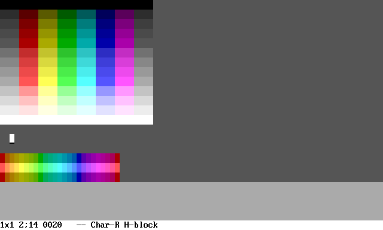

The **WinPaletteR**, **WinPaletteG** and **WinPaletteB** defines the palette, which will be used to display 16 colors in window\. You can define arbitraty colors\. Each of the parameters must consist of 32 hexadecimal digits\. Each 2 digits defines value for one channer of single color\. Below, there are some examples\.

DOS 16\-color palette with dark yellow \(default palette\):

```
WinPaletteR=00AA00AA00AA00AA55FF55FF55FF55FF
WinPaletteG=0000AAAA0000AAAA5555FFFF5555FFFF
WinPaletteB=00000000AAAAAAAA55555555FFFFFFFF
```

DOS 16\-color palette with brown instead of dark yellow:

```
WinPaletteR=00AA00AA00AA00AA55FF55FF55FF55FF
WinPaletteG=0000AA550000AAAA5555FFFF5555FFFF
WinPaletteB=00000000AAAAAAAA55555555FFFFFFFF
```

Windows VGA palette:

```
WinPaletteR=00800080008000C080FF00FF00FF00FF
WinPaletteG=00008080000080C08000FFFF0000FFFF
WinPaletteB=00000000808080C080000000FFFFFFFF
```

You can set the **WinPaletteR**, **WinPaletteG** and **WinPaletteB** parameter in other text file and you can provide the file name to **WinPaletteFile** parameter\. If there are both propertly defined **WinPaletteFile** and **WinPaletteR**/**WinPaletteG**/**WinPaletteB** parameters, the **WinPaletteFile** has higher priority\.

## Cipher settings

Settings related to cipher are:


* **CipherMode** \- Chipher mode:
  * **0** \- No cipher\.
  * **1** \- Cipher with repeated key\.
  * **2** \- Cipher with autokey on plain text\.
  * **3** \- Cipher with autokey on ciphered text\.
* **CipherBegin** \- Character codes, which indicated begining of ciphered text\. It must be at least code to enable cipher\.
* **CipherEnd** \- Character codes, which indicated ending of ciphered text\. It must be at least code to enable cipher\.
* **CipherAlphabet** \- Full cipher alphabet provided as text\. It should be consists of standard characters\. Only characters existing in the alphabet can be ciphered and used i password\. The character order is important\.
* **CipherPassword** \- Password used instead of manually input at every save or every load file\.

## Other settings

The parameters described above are not the all available parameters\. The other parameters are related to ANSI interpreter and work modes other than 0\. These parameters are described in **Readme\_ANSI\.md** file\.

## Character encodings

Console and files uses some encoding for input and output charaters\. You can input codepage or encoding name\. If value consists of digits only, it will be treated as codepage number, otherwise, it will be threated as encoding name\. If you not set or set incorrect name, the system default encoding will be used\. The **ConInputEncoding** and **ConOutputEncoding** are not the same as **FileReadEncoding** and **FileWriteEncoding**\.

The most common encodings:

| Name | Codepage | Description |
| --- | --- | --- |
| us\-ascii | 20127 | 7\-bit ASCII |
| utf\-8 | 65001 | Unicode \- UTF\-8 |
| utf\-16 | 1200 | Unicode \- little endian |
| utf\-16BE | 1201 | Unicode \- big endian |

You can set any encoding supported by \.NET API function `System.Text.Encoding.GetEncoding(Int32)` and `System.Text.Encoding.GetEncoding(String)`, details can be found on the web, list of all supported encoding can be achieved on **WorkMode=3**\. This settings affects only console input/output\.

## Encoding from file

You can create custom 8\-byte encoding, which encodes every supported character as single byte\. Many 8\-bit encodings, including 437, 1252 codepages, were popular before Unicode was widespreaded\. Such encoding assigns one character to every number from 0 to 255 \(byte value\), the same character may be assigned to several byte values\.

The file has similar convention to **Config\.txt** file, so there are list of parameters with value for each parameter\. In encoding file, the parameter is the byte value denoted as hexadecimal number and the value is denoted as hexadecimal character number\.

Lines, which does not contain the **=** character and blank lines are ignored, so you can write comments and additional information, which will not be processed\. Other parameters, such as **Name**, will also be ignored\.

To use the file, you have to place file name with path in place of the encoding name/codepage\.

You can use the **WorkMode=3** to test encoding file or display character list of system encodings\. Details are in **Readme\_keys\.md** file\.

You can generate files from all system 8\-bit encodings using **WorkMode=4**, details are in **Readme\_render\.md** file\.

## Frame elements

The **Frame1\_x** and **Frame2\_x** parameters defines the frame character set as comma separated list\. The first item is the name\. From the second item to the last item there are 11 hexadecimal character codes, which defines the frame elements by following order \(the numbers 1 and 2 are line elements, the numbers from 3 to 11 are the corner and junction elements\):

```
    -     1     \
    |     2     /

3---4---5       3
|   |   |      / \
|   |   |     6   4
|   |   |    / \ / \
6---7---8   9   7   5
|   |   |    \ / \ /
|   |   |    10   8
|   |   |      \ /
9--10--11      11
```

As you can see, the diamond is treated as rectangle rorate by 45 degrees clockwise\. Every **Frame1\_x** and **Frame2\_x** must consist of 12 item including character set name\. Application reads the correctly defined numbers to the first incorrectly defined or missing number\.

# Text cipher

TextPaint can cipher some fragments of text using Vigenere's cipher using repeated key or autokey\. If enabled, some fragments of text file can be ciphered\. Cipher setting defines characters, which begins or ends the ciphered fragments\. The remaining contents will not be ciphered, so it makes to difficult to attack the ciphered text, because the knowledge about text information and text layout is useless to guess the used password\. To achieve most security, you should meeet the conditions:


* Text to be ciphered is a random character sequence, for example randomly\-generated passwords\.
* Cipher key is random character sequence\.
* Every character in text to be cipher and cipher key exists in cipher alphabet\.
* Cipher key is longer than whole text to be ciphered\.
* One key is used to cipher one file\.

You can enable or disable cipher in **Config\.txt** setting **CipherMode**, using one of following values:


* **0** \- No cipher\.
* **1** \- Cipher with repeated key\.
* **2** \- Cipher with autokey on plain text\.
* **3** \- Cipher with autokey on ciphered text\.

If value is **0**, the cipher will be disabled regardless other settings related with cipher\. To enable cipher, you can also set to non\-blank values the following settings:


* **CipherBegin**
* **CipherEnd**
* **CipherAlphabet**

The **CipherBegin** and **CipherEnd** defines the characters, which can begin or end the text\. For example, assume, that **CipherBegin=005B,007B** and **CipherEnd=005D,007D**\. In this case, if whole text is `abcde[fghij]klmno{pqrst}uvwxy`, only the `fghij` and `pqrst` will be ciphered, the remaining fragments will be plain\.

The **CipherAlphabet** defines whole set of the characters, which must exists in text to be ciphered\. The Vigenere cipher alhorithm bases on alphabet and assigns number for every character in the alphabet\. For example, the **CipherAlphabet** value can be a sequence of small or capital letters ordered alphabetically\. Consider the two cases:


* **CipherAlphabet=abcdefghijklmnopqrstuvwxyz**
* **CipherAlphabet=qwertyuiopasdfghjklzxcvbnm**

The two values are not the same, because different numbers will be assigned for the same characters\. If **CipherAlphabet** will blank, the cipher will be disabled\. The characters defined as **CipherBegin** and **CipherEnd** must not exists in cipher alphabet\.

## Using cipher

If cipher is enabled and meets all required conditions, everytime, if you open or reload file, you will be asked for the password\. The password will be used to decipher text\. If you provide blank password \(just pressing **Enter** without inputting any characters\), the text will be loaded as is, without deciphering\. If you input wrong password, the text will be deciphered incorrectly\.

If you provide wrong password, you can retry by pressing **F8** key \(reload file\) and input password again\.

When you save file by pressing **F7** key, you will be also asket for password and you have to input the password twice\. If the first and second password are not the same, you will be again asked for password\. To save file without ciphering, just press **Enter** key twice without inputting any characters\. At the moment, you can change the password by inputting new password, which differs from the password used to load file\.

If you input password containing characters, which not exist in cipher alphabet, these characters will be ignored\. From this rule, there is one exception, described in **Password from file** subchapter\.

## Password from file

You can use file instead of password to input very long password\. To do this, you have to input password according the rules:


* The first character is the chipher begin character\.
* The last character is the chipher end character\.
* The string between the first and the last character is the filename\.

Examples assuming that **CipherBegin=005B**, **CipherEnd=005D** and **CipherAlphabet=abcdefghijklmnopqrstuvwxyz**:


* **pass123** \- The password is **pass123**\.
* **\[pas2s** \- The password is **\[pas2s**\.
* **3pass\]** \- The password is **3pass\]**\.
* **\[pass123\.txt\]** \- The password is from file **pass123\.txt** existing in the current directory\.
* **\[C:\\Documents\\pass\.123\.txt\]** \- The password is from file **pass123\.txt** existing in the **C:\\Documents\\** directory\.

The file contents will be read as text file and the text will be used as password\.

## Several password for one file

You can cipher some text fragment using the first password and the another text fragment within the same file using the second password, which differs from the first password\. To get such effects, you have to do following steps:


1. Open file\.
2. Input all fragments of text to be ciphered\.
3. Save file using the first password\.
4. Reload file using the second password\.
5. Reinput the information to be ciphered using the second password\.
6. Save the file using the second password\.

At the time, if you load file using the first password, the first information will be shown as plain text and the second information will be unreadable\. If you open the file using the second password, the first information will be unreadable and the second information will be shown as plain text\.

There is sample file read without password:

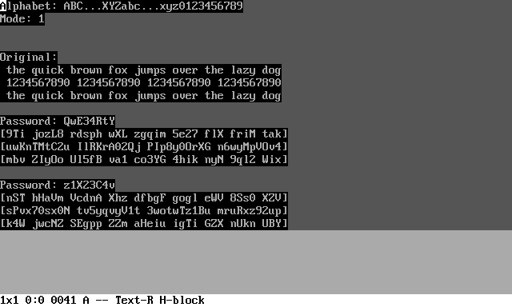

The same file read with password "QwE34RtY":

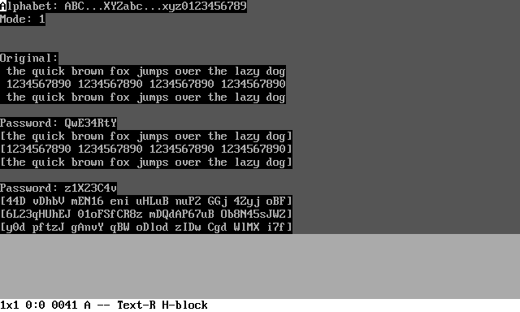

The same file read with password "z1X23C4v":

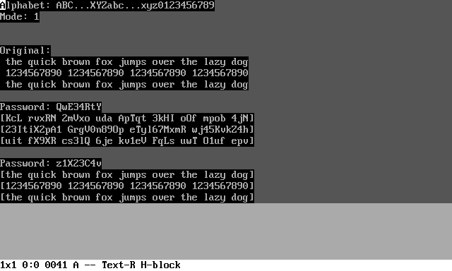

# Bitmap fonts

The **TextPaint** application supports the bitmap fonts in windows mode\. Such font is saved as bitmap file, which is provided as **WinFontName** parameter in **Config\.txt** file\. Using bitmap fonts instead of system font or console mode, has following advantages:


* Use any custom characters in unicode range\.
* Such font is truely fixed\-width\.
* Achieve old\-school look, for example like DOS or some 8\-bit computers with screen\.
* Modifying glyphs are easy, just edit bitmap in favorite image editor\.
* Avoid breaking and overlaying semigraphical glyphs\.

Using bitmap fonts has also disadvantages:


* The cell width and height must be integer multiply of glyph width and height\.
* When you use large font file \(with many pages\), opening application may take a while\.

## Bitmap font format

The bitmap font is organized in pages, single page consists of 256 characters\. Every page has number from 0 to 255, but unicode defines 17 planes from 0 to 16, so in fact, the page number are from 0 to 4351\. Bitmap can use any color mode, but the color will be thresholded into two colors, black and white, so every pixel will be readed as black or white, depending on pixel brightness\.

The bitmap width determines the font glyph and must match the formula `(W * 256) + 16)`, where **W** is the glyph width\. For example, for width 8 pixels, the bitmap must have 2064 pixels width\. The glyph height is determined by bitmap height\. The bitmap height is simply glyph height multiplied by number of pages defined in the bitmap\. The number of defined pages may vary depending on glyphs, which will be defined\.

Every row consists of binary encoded page number and glyph images of this page\. The page number code occupies 16 pixels from left and is a binary code, when black means 0 and white means 1\. The code height must be the same as glyph height\. On the glyphs part, the black \(dark\) color means 0 \(background\) and the white \(bright\) color means 1 \(foreground\)\.

The page order int he bitmap is not important\.

## Supplied fonts

The **TextPaint** supplies example bitmap fonts in **Fonts** subfolder, which can be used\. In the bitmaps, there was applied the following color convention:


* **White on black** \- Original glyphs existing in source\.
* **Yellow on blue** \- Painted or corrected glyphs\.
* **Green on purple** \- Original glyphs existing in source, but the glyph placement was changed to fix errors\.

Some fonts has glyph size 16x16, but these fonts has also 08x16 version\. Glyphs existing in 08x16 version are the same as in the 16x16 version\. In the 16x16 version there are more glyphs, which are not exist in 08x16 version\.

The example fonts are generated based on three sources, disinguished by font file name prefix:


* **Dos** \- [https://int10h\.org/oldschool\-pc\-fonts/fontlist/](https://int10h.org/oldschool-pc-fonts/fontlist/ "https://int10h.org/oldschool-pc-fonts/fontlist/") \- Standard EGA and VGA fonts, which looks like a standard DOS font\. There are added some additional glyphs:
  * **Page 25** \- Border heavy variant, quadrant boxes, four triangle glyphs from **25E2h** to **25E5h**\. The glyphs **2580h**, **2581h** and **2584h** are slightly corrected in some variants\.
  * **Page 28** \- Braille dots\.
  * **Page 1FB** \- Semigraphical shapes from **1FB00h** to **1FBAFh**, including **1FB93h**\.
* **Unscii** \- [http://viznut\.fi/unscii/](http://viznut.fi/unscii/ "http://viznut.fi/unscii/") \- All fonts from Unscii project, without any modyfication and additional glyphs but correction of **2509h** glyph in all 8x8 versions\. This fonts contains non\-standard characters, some glyph placement \(page **25h** and **1FBh**\) are manually corrected, because some glyph positions was swapped related to unicode standard\.
* **Unifont** \- [https://unifoundry\.com/unifont/](https://unifoundry.com/unifont/ "https://unifoundry.com/unifont/") \- Two versions of Unifont with manually added **1FB93h** glyph\. This font provides the most unicode coverage\. In both fonts, the 08x16 glyphs are exactly the same, so there exists single 08x16 Unifont variant\.
* **Small** \- [https://opengameart\.org/content/4x4\-px\-bitmap\-font](https://opengameart.org/content/4x4-px-bitmap-font "https://opengameart.org/content/4x4-px-bitmap-font") \- Small font, which is manually extended with many semigraphical glyphs and can be used to view large ASCII/ANSI arts\. The readibility of letters and digits is poor due to small character size\.
* **Amiga** \- [https://github\.com/rewtnull/amigafonts](https://github.com/rewtnull/amigafonts "https://github.com/rewtnull/amigafonts") \- Fonts suitable for some ASCII\-art or ANSI\-art files, which was created on Amiga computers\.
* **VT** \- [https://www\.masswerk\.at/nowgobang/2019/dec\-crt\-typography](https://www.masswerk.at/nowgobang/2019/dec-crt-typography "https://www.masswerk.at/nowgobang/2019/dec-crt-typography") \- The font, which is used in real DEC VT220 terminal, extended with some semigraphical glyphs\.

# Other supplied files

In the TextPaint filder, there are included some other files than bitmap fonts, which can help to use this software, especially the editor \(**WorkMode=0**\)\.

## Encodings

TextPaint can use custom 1\-byte encoding\. In the Encodings subfolder, there are 4 files\. The following 2 files are suitable for opening ANSI/ASCII files and has control character mapped as are:


* **ASCII\.txt** \- The base ASCII\-compatible encoding, where the character number equals to byte balue\. You can create copy of the file and use it to create own encoding\. The encoding is the same as ISO\-8859\-1\.
* **STD437\.txt** \- The standard DOS code page 437, suitable for use with font other than DOS font\. The encoding is identical with built\-in 437 encoding, the 437 encoding is required for read most old ANSI files\.
* **DOS437\.txt** \- The slightly modified standard DOS code page 437\. The modification are changing few characters to match to **Dos** font\. The ambiguous characters are listed an the end of the file \(lines without **=** sign are ignored\)\. The file or standard 437 code page should be used to open most old ANSI and ASCII files\.
* **VT220\.txt** \- Encoding very similar to ASCII \(only few characters changed\), intended to view original VT100 files from [http://artscene\.textfiles\.com/vt100/](http://artscene.textfiles.com/vt100/ "http://artscene.textfiles.com/vt100/"), which uses 8\-bit characters supported on VT220 terminal and successors\.

There are another 2 encodings, which are designed for converting BIN or XBIN file to ANSI file\. The only difference are in assignment to values from **00h** to **1Fh**:


* **ASCII\_BIN\.txt** \- Encoding based on **ASCII\.txt**, the control characters are remaped to from **2400h** to **241Fh**, the characters are printable equivalents to control characters\.
* **STD437\_BIN\.txt** \- Encoding based on **STD437\.txt**, the control characters are mapped to standard DOS glyphs\.
* **DOS437\_BIN\.txt** \- Encoding based on **DOS437\.txt**, the control characters are mapped to standard DOS glyphs\.

## Palettes

In the **Palettes** subfolder, there are three example palette files, which can be used to parameter **WinPaletteFile**:


* **DOS\.txt** \- Standard DOS palette without exception\.
* **DOSBrown\.txt** \- Standard DOS palette with exception, that there is brown color instead of dark yellow\.
* **WinVGA\.txt** \- Standard Windows 16\-color VGA palette\.

## Samples

There are samples for demonstration and test purposes in **WorkMode=0**\. Files other than **8bitASCII\.txt** are encoded using UTF\-8\.


* **8bitASCII\.txt** \- Standard 8\-bit ASCII file, which should be opened using 1\-byte encoding\. You can test 1\-byte encoding matches and display all available character in such encoding\. There is only file, which is in ANSCII encoding\.
* **Borders\.txt** \- Demonstrates border and block characters\.
* **Cipher\.txt** \- Demonstrates text chiphering\. To use this file, you chould open using following parameters:
  * **CipherMode=0**
  * **CipherAlphabet=ABCDEFGHIJKLMNOPQRSTUVWXYZabcdefghijklmnopqrstuvwxyz0123456789**
  * **CipherBegin=005B**
  * **CipherEnd=005D**
* **Math\.txt** \- Demonstrates the Unicode alphabets used in mathemating notation\.
* **Unscii\.txt** \- Demonstration art for Unscii font\. There is corrected art based on [http://viznut\.fi/unscii/](http://viznut.fi/unscii/ "http://viznut.fi/unscii/")\.
* **FontSize\.ans** \- Various font sizes\.
* **ColorWheel\.ans** \- Demonstration of all 16 colors, uses Unicode characters\.
* **ColorBlend\.ans** \- Color blending demonstration\.

There are also samples, which are not created with **TextPaint**, but can be loaded into **TextPaint** or other terminal emulator or any ANSI file viewer:


* **Colors16\.ans** \- Two ways to use all 16 standard colors\. If bold and blink is not ignored, **TextPaint** shows the same result in both ways\.
* **Colors256\.ans** \- The 256\-color palette, **TextPaint** reada 256\-color codes, but converts such colors into standard 16 colors\. The file uses both semicolon and colon commands\.
* **RGB\_R\.ans** \- The 24\-bit RGB color demonstration, red variant\. **TextPaint** reads RGB color codes, but converts such colors into standard 16 colors\.
* **RGB\_G\.ans** \- The 24\-bit RGB color demonstration, green variant\. **TextPaint** reads RGB color codes, but converts such colors into standard 16 colors\.
* **RGB\_B\.ans** \- The 24\-bit RGB color demonstration, blue variant\. **TextPaint** reads RGB color codes, but converts such colors into standard 16 colors\.
* **TextFormat\.ans** \- Test of all VT100 text format flags \(bold, blink, negative, underline\)\. **TextPaint** ignores underline flag, but the file can be used for test other terminals\.


