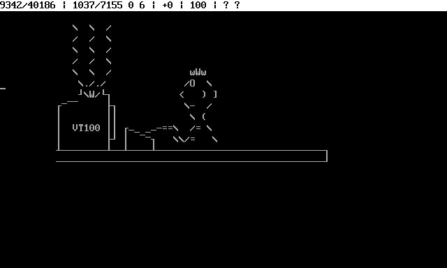
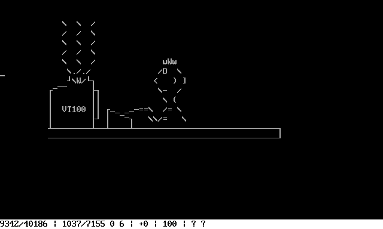
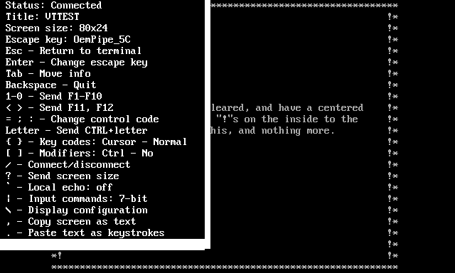

# ANSI in TextPaint

TextPaint can handle ANSI escape codes, which allows to get colored text using colors from palette of standard 16 items, which was used in DOS operating system and ANSI\-compatible text terminals\. In 1990s the ANSI files was popular format of colorful ASCII\-art, which was called as ANSI\-art\.

Some ANSI files contains simple animation achieved by manipulating cursor position and character writing out of the line\-by\-line order\. Such files was animated where was displayed slowly\. Most BBS and similar services provides about 2400 bits per second\.

TextPaint can handle ANSI files and provides other work modes, which also uses the same ANSI interpreter\.

## Playing animations

The **WorkMode=2** is usable for displaying simple animations by progressive and slowly processing data from file\. You can also start the server on choosen port, which serves the same contents of file\. This feature can be used for comparing displaying file with other Telnet client\.

Details abou the feature is described in **Animation playback and server** chapter\.

## Telnet client

TextPaint can act as terminal emulator in **WorkMode=3**\. This emulator can handle following connection types:


* Telnet protocol\.
* SSH protocol with login and password\.
* Raw plain text connection without protocol\.
* Serial port\.
* Application with redirection of standard streams\.

The compatibility with VTxxx is detailed in **VTTEST compatibility** chapter\.

# Additional settings

The **Config\.txt** contains parameters, which are related with ANSI interpreter or network features\. Like other parameters, every parameter in **Config\.txt** can be overrided with parameter in command line\.

The parameters, which is not described below, are described in **Readme\.md** file\.

## ANSI\-related settings

The following parameters are especially related to creating or interpreting ANSI data and affects in **WorkMode=0**, **WorkMode=1** and **WorkMode=2**:


* **ANSIRead** \- Use ANSI interpreter instead of plain text file on file reading in **WorkMode=0**, this parameter affects both reading file in application running or pressing **F8** key:
  * **0** \- Read file as plain text file without ANSI interpreter\.
  * **1** \- Read file as ANSI file using ANSI interpreter\. In file contains animation, there will be read final display\.
* **ANSIReadCR** \- Reaction by the CR character while reading ANSI file in **WorkMode=0** or **WorkMode=1**\. This parameter can fix incorrectly written text or ANSI files:
  * **0** \- Process as CR character only \(recommended\)\.
  * **1** \- Process as CRLF character sequence \(recommended with **ANSIReadLF=2**\)\.
  * **2** \- Ommic CR character\.
* **ANSIReadLF** \- Reaction by the LF character while reading ANSI file in **WorkMode=0** or **WorkMode=1**\. This parameter can fix incorrectly written text or ANSI files:
  * **0** \- Process as LF character only \(recommended\)\.
  * **1** \- Process as CRLF character sequence \(recommended with **ANSIReadCR=2**\)\.
  * **2** \- Ommic LF character\.
* **ANSIWidth** \- Width of ANSI virtual screen \(not to be confused with **WinW** parameter\) for **WorkMode=0** and **WorkMode=4**\. If not set, the default is **80**\.
* **ANSIHeight** \- Height of ANSI virtual screen \(not to be confused with **WinH** parameter\) for **WorkMode=0** and **WorkMode=4**\. If not set, the default is **24** \(when **ANSIDOS=0**\) or **25** \(when **ANSIDOS=1**\)\.
* **ANSIAutoSize** \- Automatically resize screen according the DECCOLM, DECSNLS and XTWINOPS commands\. Requires **WinFixed>0** for **WorkMode=1** and **WorkMode=2**\.
* **ANSIBufferAbove** \- Use extending buffer above the screen, affects in **WorkMode=0** and **WorkMode=4**\.
* **ANSIBufferBelow** \- Use extending buffer below the screen, affects in **WorkMode=0** and **WorkMode=4**\.
* **ANSIDOS** \- Use DOS behavior instead of standard VTxxx/ANSI\-derivative behavior, there are some differences, which affects correctness of ANSI display depending on source\.
* **ANSI8bit** \- Allow for 8\-bit control characters\. These characters has number between **80h** and **9Fh** and are the equivalent for **1Bh** followed by character numbered between **20h** and **3Fh**\. Set to **1** only if neccesary, for compatibility with some animations and remote services\.
* **ANSIColor** \- Use ANSI colors\. You can disable using the ANSI colors for simulate monochrome terminal, which does not support the colors\.
* **ANSIReverseMode** \- Mode for reverse color:
  * **0** \- No reverse \- ignore reverse attribute\.
  * **1** \- Before bold and blink \- compatible with most ANSI files for DOS\.
  * **2** \- After bold and blink \- compatible with original VTxxx terminals for Telnet/SSH session with Unix, Linux and MacOS\.
* **ANSIColorBold** \- Interpret bold attribute as text color\. Some ANSI files was created assuming that terminal displays bold text as bright color\.
* **ANSIColorBlink** \- Interpret blink attribute as background color\. Some ANSI files was created assuming that terminal displays blinking text as steady text on bright background\. Some other ANSI files was created assuming terminal displays text as blinking\.
* **ANSIIgnoreConcealed** \- Ignore concealed \(hidden, invisible\) attribute while interpreting ANSI data\.
* **ANSIPrintBackspace** \- Print backspace character \(while **ANSIDOS=1**\) or ignore backspace character \(while **ANSIDOS=0**\) instead of moving cursor backward\.
* **ANSIPrintTab** \- Print tab character \(while **ANSIDOS=1**\) or ignore tab character \(while **ANSIDOS=0**\) instead of moving cursor to nearest tab stop\.
* **ANSIWrite** \- Save colors as ANSI escape codes using key **F7** in **WorkMode=0**:
  * **0** \- Write file as plain text, ommiting colors\.
  * **1** \- Write file as ANSI text including color definition\.
* **ANSICharsDOS** \- List of 32 replacement character codes, to use as printable of characters from **00h** to **31h** while **ANSIDOS=1**\.
* **ANSICharsVT100** \- List of 32 replacement character codes, to use as VT100 graphics characters from **5Fh** to **7Eh**\.
* **ANSICharsVT52** \- List of 32 replacement character codes, to use as VT52 graphics characters from **5Fh** to **7Eh**\.
* **ANSIScrollSmooth** \- Display smooth scroll when smooth scroll state is set\. This parameter may have following values:
  * **0** \- Do not use smooth scroll\.
  * **1** \- No text movement, delay only\.
  * **2** \- Move text by half of height\.\.
  * **3** \- Move text by quarter of height\.
  * **4** \- Move text by eighth of height\.
* **ANSIScrollChars** \- Number of characters, which smooth scroll durates\. Use 0 to turn off smooth scroll\.
* **ANSIScrollBuffer** \- Buffer length in characters, for buffering arriving characters while scrolling\. Use this settings to achieve more smooth scrolling\. Set **0** for disable this buffer\.
* **ANSIColorThresholdBlackWhite** \- Black and white color threshold used to convert from 256\-color or 24\-bit RGB into 6 colors\. The value can be between **0** \(not use black and white colors\) and **127** \(use black and white colors only\)\.
* **ANSIColorThresholdGray** \- Grayscale saturation threshold\. There is the maximum saturation, which is classified as gray color\. The value can be between **0** \(use gray only for unsaturated colors\) and **100** \(use gray colors for all colors brighter than black and darker than white\)\.

## Animation player settings

The parameters affects only in **WorkMode=1**, which purpose is displaying animation on serving file contents via network:


* **FileDelayStep** \- Number of steps processed within single cycle\.
* **FileDelayOffset** \- Starting file position when display:
  * **Positive value** \- Number of steps from begin\. If number exceedes the movie length, it will positioned at the end\.
  * **Negative value** \- Number of steps to end\. If the absolute value of number exceedes the movie length, it will positioned at the begin\.
  * For display en the end, use very large number, like **1000000000**\.
* **FileDelayTime** \- Time in milliseconds between displaying two portions of steps\.
* **FileBrowseWildcard** \- The file mask, which will be applied while browsing by **PageUp** and **PageDown** while **TextPaint** running\. Several file masks must be separated by semicolon\. The mask may help to avoid non\-ANSI files while browsing\.
* **ServerPort** \- Number of network port, on which the serwer will listen for connection\. In order to not use server, set **ServerPort=0**\.
* **ServerEncoding** \- Character encoding used to send data via network if **ServerPort>0**\.
* **ServerTelnet** \- Use the Telnet protocol \(**1**\) instead of raw transmission \(**0**\) in the server\. Works only, if **ServerPort>0**\.

## Terminal settings

The parameters affects only in **WorkMode=2** while connecting or working as Telnet client:


* **TerminalEncoding** \- Character encoding used to aquire characters from Telnet service\.
* **TerminalConnection** \- Type of connection \(case insensitive\):
  * **Loopback** \- Loopback without connection\. The provided address will be ignored\. This connection can be used for terminal test\.
  * **Telnet** \- Telnet protocol\.
  * **SSH** \- SSH protocol with authentication using login and password\.
  * **Raw** \- Socket network connection without any protocol\.
  * **Serial** \- Communication via serial port\.
  * **Application** \- Application with standard stream redirection\. The application must use standard I/O streams to work\.
* **TerminalName** \- Terminal name sent to server, when server asks for client terminal name\. In some cases service can require certain terminal name or service behavior can vary depending on provided terminal name\.
* **TerminalType** \- Terminal type simulated in reports depending on terminal type\. This setting does not matter the terminal emulation and ANSI processing, but may affect working with some servers, which requests information about terminal type\. There are following possible values:
  * **0** \- VT100\.
  * **1** \- VT102 \(default\)\.
  * **2** \- VT220\.
  * **3** \- VT320\.
  * **4** \- VT420\.
  * **5** \- VT520\.
* **TerminalFile** \- If not blank, there is the file, to which the terminal display will be dumped with time markers\. This file can be played directly using **WorkMode=1** or rendered using **WorkMode=4**\.
* **TerminalTimeResolution** \- The number of milliseconds between two display cycles\. Decreasing this value induces the more fluenty terminal display, but causes more CPU usage during working\.
* **TerminalStep** \- The maximum number of processing steps within single display cycle\. The **0** value means unlimited number\. This parameter can be used to simulate low receiving transfer speed or for smooth scroll simulation\.
* **TerminalKeys** \- The code of terminal keyboard codes configuration, consists of 4 digits\. Described on **Terminal Client** chapter\.
* **TerminalAnswerBack** \- The AnswerBack message\.
* **ServerPort** \- Number of network port, on which the serwer will listen for connection\. In order to not use server, set **ServerPort=0**\.
* **ServerEncoding** \- Character encoding used to send data via network if **ServerPort>0**\.
* **ServerTelnet** \- Use the Telnet protocol \(**1**\) instead of raw transmission \(**0**\) in the server\. Works only, if **ServerPort>0**\.

## Serial port address

The address of serial port consists of 6 elements separated by colon, for example **COM1:9600:8:0:1:0**\. These element meaning are following:


1. The port name, usually **COM1**, **COM2** etc\.
2. Baud rate in bps\.
3. Data bits, usually **8**\.
4. Parity bit as following:
   * **0** \- None\.
   * **1** \- Odd\.
   * **2** \- Even\.
   * **3** \- Mark\.
   * **4** \- Space\.
5. Stop bits, usually **1**, as following:
   * **0** \- None\.
   * **1** \- One bit\.
   * **2** \- Two bits\.
   * **3** \- One and half\.
6. Flow control, usually **0**, as following:
   * **0** \- None\.
   * **1** \- XOn/XOff\.
   * **2** \- RTS\.
   * **3** \- XOn/XOff and RTS\.

# Server feature

In the **WorkMode=1** and **WorkMode=2**, you can run the server listening on the port specified as **ServerPort**\.

if parameter **ServerPort** has value other than **0**, you can connect from another terminal into the server via the port\. As network client you can use other terminal emulator\. If **ServerPort** is set to **0**, the step will not run\. You can connect several clients at once\. If you want to use the Telnet client, you should set the **ServerTerminal=1**, because Telnet client can send special negotiation message ans derver can send the 0xFF byte\. The server ignores all negotiation messages sent transfered from clients, and repeats every 0xFF\.

If you want to connect raw client \(not telnet\), you should use the **ServerTerminal=0**\.

The server sends screen display characters into all clients simultaneously\. The used encoding can be set by **ServerEncoding** parameter\.

In the **WorkMode=1**, TextPaint ignores all data sent from client\.

In the **WorkMode=2**, TextPaint redirects all data sent from all clients into connection\.

# DOS vs\. VTx terminal

Older ANSI files uses features of DOS terminal, which works slightly differently than standard VTx/ANSI terminal\. The differences cannot be accomodate with each other, because the same data sequence \(text with escape codes\) giver different result\. In the table below, there are all differences:

| Feature | VTx/Unix data \- ANSIDOS=0 | ANSI/DOS data \- ANSIDOS=1 |
| --- | --- | --- |
| Text wrapping\. | After writing character at the last column, cursor remains at the same line\. The cursor jumps into beginning of next line only after writing one more character and this character will be written at the first column\. | After writing character at the last column, cursor immediately jumps into beginning of next line\. |
| Characters from **00h** to **1Fh**, excluding from **05h**, **07h** to **0Dh**, **1Ah**, **1Bh**\. | Character will be ignored\. | Character will be written using assigned printable character according standard DOS character glyph for control characters\. |
| Character **05h** \- enquiry | Request AnswerBack message | Write character **2663h**\. |
| Character **07h** \- bell | Emit the "bell" sound\. | Write character **2022h**\. |
| Character **08h** \- backspace | Move cursor left one column or ignore\. | Move cursor left one column or write character **25D8h**\. |
| Character **09h** \- horizontal tab | Move cursor right to the nearest multiply of 8 columns or ignore\. | Move cursor right to the nearest multiply of 8 columns or write character **25CBh**\. |
| Character **0Bh** \- vertical tab | Move cursor down one line\. | Write character **2642h**\. |
| Character **0Ch** \- form feed | Same as **0Ah**\. | Write character **2640h**\. |
| Character **7Fh** | Ignore\. | Write character **7Fh**\. |
| Sequence **1Bh D** | Move cursor one line up, scroll if necessary\. | Ignore\. |
| Sequence **1Bh M** | Move cursor one line down, scroll if necessary\. | Enter into music state\. |
| Sequence **1Bh \[ x L** | Scroll **x** lines up\. | Ignore\. |
| Sequence **1Bh \[ x M** | Scroll **x** lines down\. | Enter into music state\. |
| Sequence **1Bh \[ x C** | Move cursor right, if **x** exceedes distance to the last column, leave cursor at the last column\. | Move cursor right, if **x** exceedes distance to the last column, jump to begining of next line and move remaining value from begining of next line\. |
| Sequence **1Bh \[ 2 J** | Clear screen only\. | Clear screen and move cursor to upper left corner\. |

## Recommended display settings

The difference between DOS and VTx data implies different values for some parameters\. Below there are listed recommended values in most cases, but you can use other values:

| Parameter | Value for VTx/Unix | Value for ANSI/DOS |
| --- | --- | --- |
| ANSIDOS | 0 | 1 |
| ANSI8bit | Usually 0, sometimes may require 1 | 0 |
| ANSIPrintBackspace | 0 | Usually 0, sometimes 1 |
| ANSIPrintTab | 0 | Usually 0, sometimes 1 |
| ANSIReadCR | Usually 0, sometimes 2 | 0 |
| ANSIReadLF | Usually 0, sometimes 1 | 0 |
| DisplayBlink | 1 | 0 or 2 \(depending on data\) |
| DisplayAttrib | 15 | 0 |
| ANSIColors | 1 | 1 |
| ANSIReverseMode | 2 | 1 |
| ANSIColorBold | 0 | 1 |
| ANSIColorBlink | 0 | 0 or 1 \(depending on data\) |
| ANSIIgnoreConcealed | 0 | 0 |

## Music state

Some ANSI files uses ANSI music, which generates simple sounds through PC speaker\. Sequence **1Bh M** or **1Bh \[ x M** informs the application, that following printable characters will define sound sequence and are not to write on the screen\. The last character of such sequence is **0Eh** and demands the application to exit from the music state\. If **03h** or **0Eh** occurs without entering into music state, the character will be printed or ignored according the **ANSIDOS** parameter\.

When **ANSIDOS=0**, the music state is not available\. Generating the sound is not implemented, because there is very rarely used and is not necessary to view or edit ANSI file\.

## DOS control character assignment

Characters from 00h to 1Fh are control characters and should be treated as non\-printable characters\. DOS has ability to print control character in some cases and it was used in some ANSI files\.

| Byte value | Character name | Default printable character |
| --- | --- | --- |
| 00h | NUL | 0020h |
| 01h | SOH | 263Ah |
| 02h | STX | 263Bh |
| 03h | ETX | 2665h |
| 04h | EOT | 2666h |
| 05h | ENQ | 2663h |
| 06h | ACK | 2660h |
| 07h | BEL | 2022h |
| 08h | BS | 25D8h |
| 09h | HT | 25CBh |
| 0Ah | LF | 25D9h |
| 0Bh | VT | 2642h |
| 0Ch | FF | 2640h |
| 0Dh | CR | 266Ah |
| 0Eh | SO | 266Bh |
| 0Fh | SI | 263Ch |
| 10h | DLE | 25BAh |
| 11h | DC1 | 25C4h |
| 12h | DC2 | 2195h |
| 13h | DC3 | 203Ch |
| 14h | DC4 | 00B6h |
| 15h | NAK | 00A7h |
| 16h | SYN | 25ACh |
| 17h | ETB | 21A8h |
| 18h | CAN | 2191h |
| 19h | EM | 2193h |
| 1Ah | SUB | 2192h |
| 1Bh | ESC | 2190h |
| 1Ch | FS | 221Fh |
| 1Dh | GS | 2194h |
| 1Eh | RS | 25B2h |
| 1Fh | US | 25BCh |

The characters from **00h** to **1Fh** from the ANSI file can be printed in exception of **0Ah**, **0Dh**, **1Ah** and **1Bh**\.

The printable character assignment can be changed by **ANSICharsDOS** setting\.

# Animation playback

The **WorkMode=1** allows to display any file using sequentially displaying character to view simple ANSI animations or graphics like while downoading in real time\. After running this **TextPaint** with **WorkMode=1** parameter, you will see information about functions available during displaying\. At this state, you can change current file by writing full path of another file\. The file name with path will be written also, if you drop file icon into window\.

To start displaying file, press **Enter**, in order to quit **TextPaint**, press **Tab**\.

You can play the animation forward, backward or seek manually by pressing appropiate keys\.

You can use the following keys while animation display:


* **Esc** \- Return to information screen\.
* **Tab** \- Show or hide status bar\.
* **\`** \- Change information displayed on the status bar\.
* **Space** \- Show the file information including SAUCE\. For return, you have to press one of the following keys: **Space**, **Esc**, **Enter**, **Backspace**\.
* **Enter** \- Start or stop playing forward, according the **FileDelaySteps** and **FileDelayTime** parameters\.
* **Backspace** \- Start or stop playing backward, according the **FileDelaySteps** and **FileDelayTime** parameters\.
* **Up Arrow** and **Down Arrow** \- Move animation position by one step\.
* **Left Arrow** and **Right Arrow** \- Move animation position by steps defined as **FileDelaySteps**\.
* **Home** \- Move into animation begin\.
* **End** \- Move into animation end\.
* **\]** \- Increase playing speed\.
* **\[** \- Decrease playing speed\.
* **/** \- Reset playing speed\.
* **Page Up** or **Page Down** \- Prowse for previous or next file\.
* **\\** \- ANSI processing parameters and display configuration\.

In order to quit application, ples the **Esc** key to return to information and press **Tab** key to quit\.

## Status bar

During display, you can show or hide the status bar by pressing **Tab** key, Using the the **\`** or **~** key you can switch between the five states\.


* **State 1** \(default\) \- Basic information about file and playback:
  * Position step and animation length\.
  * Three elements for help to distinguish animation and still image:
    * Number of overwritten characters per all writen characters\.
    * Number of insert/delete operations\.
    * Number of scroll operations\.
  * Current speed change, 0 means default speed defined as **FileDelayStep** parameter\. You can change the speed usin **\+** and **\-** keys\. Alternatively, you can use the **=** and **\_** keys\.
  * Current index number and number of all files followed by current file name\. You can switch between files using **Page Up** and **Page Down** keys\. The character separating the index number and file name has the following meaning:
    * **Colon sign** \- The file does not contain the SAUCE information\.
    * **Equation sign** \- The file contains the SAUCE information, which can be shown by pressing the **Space** key\.
* **State 2** \- Animation details:
  * Position step and animation length\.
  * Three elements for help to distinguish animation and still image:
    * Number of overwritten characters per all writen characters\.
    * Number of insert/delete operations\.
    * Number of scroll operations\.
  * Current animation speed:
    * **0** \- Default speed\.
    * **Positive number** \- Increased speed\.
    * **Negative number** \- Decreased speed\.
  * Current animation speed as number of playback steps\.
  * Number of current step and minimum/maximum number of dummy steps added by **1Bh \[ 1; P1 V** \(time marker\) sequence\. The negative number means, that the time presented by time marker represents ealier number of steps\. In such case, the display can be slightly glitched\. You have to increase the **FileDelayStep** parameter to solve this problem\. If the time marker is not processet, there will be displayes two question marks\.
* **State 3**, **State 4** and **State 5** \- the states allows to follow the character processing during playback\.
  * Position step and animation length\.
  * Current character and animation character number \(may vary depending on **FileReadEncoding** parameter\)\.
  * Last processed character, in this information there is difference between the three states:
    * **State 3** \- Display characters above 0x1Fh as characters and below 0x20h as numbers\.
    * **State 4** \- Display characters from 0x21h to 0x7E as characters and other characters as numbers\.
    * **State 5** \- Display all characters as numbers\.

Every press **Tab** key forces screen to repaint, so if screens displays glitches, press the **Tab** or **\`** or **~** key to repaint\.


Status bar at the top, covers the first line\.



Status bar at the bottom, covers the last line\.



## Animation versus still picture

The most ANSI files can be classified into three categories:


* Still picture, which size is in the screen size \(usually 80x24 or 80x25\)\.
* Still picture, which size exceedes the screen size vertically \(at the end of play, the bottom part is visible\)\.
* Animation created using ANSI/VTxxx commands\.

There is no way to distinguisg there types, but **TextPaint** counts some operations, which allows to suppose \(but without sure\), what is the file kind:


* **Character overwrites** \- Occurs very frequently in animations, but rather not occurs in still pictures\. You have to count both overwrites and all characters prints for compare\. The character print will be classified as overwrite, where meets at least one of following conditions when comparing to previous character in the same place \(the font attribues such as bold or underline are treated as foreground color\):
  * Previous character is not a space and next character is different to previous character\.
  * Previous character is not a space and the foreground color is not a default color and the next foreground color is different to previous color\.
  * The background color is not a default color and the next background color is different to previous color\.
* **Insert and delete characters** \- May occur in some VTxxx animations\. There are counting the following commands:
  * **SR**, **SL** \- counted twice \(there is combination of insert and delete\), multiplied by number of affected text lines\.
  * **DECBI**, **DECFI**, **ICH**, **DCH** \- counted as single operation\.
* **Scroll action** \- Every scroll action \(up or down\) caused by appropriate character or command\. Still picture exceeding the screen size will cause many scroll actions\.

# Telnet client

TextPaint provides simple Telnet client, whis can be used to test ANSI interpreter compatibility with VTxxx/ANSI terminal\. Telnet client is available in **WorkMode=2** and you have to provide addres in place of file name in command line\. For example, you can provide **localhost:23** if you have working local telnet server\.

In most cases, this is recommended to set **ANSIWidth** to **80** and **ANSIHeight** to **24**\. If you not specify, the default width and height will be used\.

After running **TextPaint**, choose and press key, which will be used as escape key\. The escape key means the key, which provides access to functions instead of sending keystroke to server\.


The escape key can be changed during the session\. After pressing the key, the session will begin and you can use the server service\.


During the session, if you press the selected escape key, the information window will popup and you will can use special keys:


* **Esc** \- Return to terminal \(close information\)\.
* **Enter** \- Change escape key\.
* **Tab** \- Move information window\.
* **Backspace** \- Quit from application\.
* **=** or **;** or **:** \- Switch number key \(number from **1** to **9** followed by **0**\) function between six states:
  * **State 1** \- Send keys from **F1** to **F10**\.
  * **State 2** \- Send keys from **F11** to **F20**\.
  * **State 3** \- Use **\[** and **\]** keys to send the **AnswerBack** message and use the number keys to send as following:
    * **Number 2** \- NUL \(00h\) \- **Ctrl**\+**2**, **Ctrl**\+**@**, **Ctrl**\+**Space**\.
    * **Number 3** \- ESC \(1Bh\) \- **Ctrl**\+**3**, **Ctrl**\+**\[**, **Ctrl**\+**\{**\.
    * **Number 4** \- FS \(1Ch\) \- **Ctrl**\+**4**, **Ctrl**\+**\\**, **Ctrl**\+**&#124;**\.
    * **Number 5** \- GS \(1Dh\) \- **Ctrl**\+**5**, **Ctrl**\+**\]**, **Ctrl**\+**\}**\.
    * **Number 6** \- RS \(1Eh\) \- **Ctrl**\+**6**, **Ctrl**\+**^**, **Ctrl**\+**~**\.
    * **Number 7** \- US \(1Fh\) \- **Ctrl**\+**7**, **Ctrl**\+**\_**, **Ctrl**\+**/**\.
    * **Number 8** \- DEL \(7Fh\) \- **Ctrl**\+**8**, **Ctrl**\+**?**\.
  * **State 4**, **State 5** and **State 6** \- The same as three first states, there are available other keys for send control codes instead of some functions\.
* **<** \- Send **F11** key or **AnswerBack** message\.
* **>** \- Send **F12** key or **AnswerBack** message\.
* **Letter** \- Send letter with Ctrl modifier, like Ctrl\+X\.
* **\{** or **\}** \- Change codes for function keys, arrows, and position keys, detailed in **Key codes** subchapter\. Theere are the following settings:
  * **1** \- **Arrow** keys \- two variants\.
  * **2** \- Keys from **F1** to **F4** \- two variants\.
  * **3** \- Keys from **F5** to **F12** \- two variants\.
  * **4** \- Navigation keys \(**Ins**, **Del**, **Home**, **End**, **PgUp**, **PgDown**\) \- three variants\.
  * **5** \- **Enter** key \- three variants\.
  * **6** \- **Backspace** key \- two variants\.
  * **7** \- **Numpad** keys \- two variants\.
* **\[** or **\]** \- Enable forcing modifier keys \(Control, Alt, Shift\) for function keys, navigation keys and arrows\. Usable when pressing such key with modifier is neccesary for appliaction, but **TextPaint** does not receive such combination:
  * **1** \- Force Control\.
  * **2** \- Force Alt\.
  * **3** \- Force Shift\.
* / \- Connect od disconnect, depending on current state\.
* **?** \- Send screen size to server, some servers requires such information\.
* **\`** \- Enable or disablo local echo\. While enabled, all printable characters, **Enter** and **Backspace** key will be sent both to server and to terminal\.
* **\\** \- ANSI processing parameters and display configuration\.
* **,** \- Copy screen to system clipboard as plain text\. The leading and trailing blank lines will be ommited\.
* **\.** \- Paste text from system clipboard as keystrokes\.



## Telnet client limitations

**TextPaint** has some limitations compared to other Telnet/SSH software due to architecture and appleid approaches:


* Limited compatibility with VTxxx/ANSI terminals, the compatibility is sufficient in most cases\.
* SSH relys on the Renci SSH\.NET library\. This library does not support terminal resize and sending screen size causes shell restart\.
* TextPaint recognizes XTERM 256 colors and 24\-bit RGB, but these colors are converted to standard 16 colors\.
* XTERM mouse is not supported\.
* For XTWINOPS command, there are assumptions and limitations:
  * Cell size in pixels for reporting and changing window size is always 8x16\.
  * Reported window position is always \(0,0\)\.
  * Reported window state is always normal\.
  * Resizing is the only command taking any effect\.
  * Other commands \(iconify/deiconify, set position, raise/lower\) does not work, but not matter for any application/service\.

## Key codes

The telnet client has several control code sets for some special keys to achieve compatibility with most services\. The initial setting is defined by **TerminalKeys** setting\. this parameter consists of 7 digits:


1. Arrows \- **0** or **1**
2. Functions from **F1** to **F4** \- **0** or **1**
3. Functions from **F5** to **F12** \- **0** or **1**
4. Navigation keys \- **0** or **1** or **2**
5. Enter key \- **0** or **1** or **2**
6. Backspace key \- **0** or **1**
7. VTxxx Numpad keys: Numbers, Enter, Comma, Dot, Minus \(use Plus instead of Enter for work\) \- **0** or **1**

There is keys and codes, which will sent to server for each possible setting:

| Key | Number of digit | Value = 0 | Value = 1 | Value = 2 |
| --- | --- | --- | --- | --- |
| Up Arrow | 1 | 1Bh \[ A | 1Bh O A | N/A |
| Down Arrow | 1 | 1Bh \[ B | 1Bh O B | N/A |
| Right Arrow | 1 | 1Bh \[ C | 1Bh O C | N/A |
| Left Arrow | 1 | 1Bh \[ D | 1Bh O D | N/A |
| F1 | 2 | 1Bh \[ 1 1 ~ | 1Bh O P | N/A |
| F2 | 2 | 1Bh \[ 1 2 ~ | 1Bh O Q | N/A |
| F3 | 2 | 1Bh \[ 1 3 ~ | 1Bh O R | N/A |
| F4 | 2 | 1Bh \[ 1 4 ~ | 1Bh O S | N/A |
| F5 | 3 | 1Bh \[ 1 5 ~ | 1Bh O T | N/A |
| F6 | 3 | 1Bh \[ 1 7 ~ | 1Bh O U | N/A |
| F7 | 3 | 1Bh \[ 1 8 ~ | 1Bh O V | N/A |
| F8 | 3 | 1Bh \[ 1 9 ~ | 1Bh O W | N/A |
| F9 | 3 | 1Bh \[ 2 0 ~ | 1Bh O X | N/A |
| F10 | 3 | 1Bh \[ 2 1 ~ | 1Bh O Y | N/A |
| F11 | 3 | 1Bh \[ 2 3 ~ | 1Bh O Z | N/A |
| F12 | 3 | 1Bh \[ 2 4 ~ | 1Bh O \[ | N/A |
| Insert | 4 | 1Bh \[ 2 ~ | 1Bh \[ 2 ~ | 1Bh \[ 2 ~ |
| Delete | 4 | 1Bh \[ 3 ~ | 1Bh \[ 3 ~ | 1Bh \[ 3 ~ |
| Home | 4 | 1Bh \[ 1 ~ | 1Bh O H | 1Bh \[ H |
| End | 4 | 1Bh \[ 4 ~ | 1Bh O F | 1Bh \[ F |
| Page Up | 4 | 1Bh \[ 5 ~ | 1Bh \[ 5 ~ | 1Bh \[ 5 ~ |
| Page Down | 4 | 1Bh \[ 6 ~ | 1Bh \[ 6 ~ | 1Bh \[ 6 ~ |
| Enter | 5 | 0Dh | 0Dh 0Ah | 0Ah |
| Backspace | 6 | 7Fh | 08h | N/A |
| 0 | 7 | 0 | 1Bh O p | N/A |
| 1 | 7 | 1 | 1Bh O q | N/A |
| 2 | 7 | 2 | 1Bh O r | N/A |
| 3 | 7 | 3 | 1Bh O s | N/A |
| 4 | 7 | 4 | 1Bh O t | N/A |
| 5 | 7 | 5 | 1Bh O u | N/A |
| 6 | 7 | 6 | 1Bh O v | N/A |
| 7 | 7 | 7 | 1Bh O w | N/A |
| 8 | 7 | 8 | 1Bh O x | N/A |
| 9 | 7 | 9 | 1Bh O y | N/A |
| \+ \(use as Enter\) | 7 | \+ | 1Bh O M | N/A |
| , | 7 | , | 1Bh O l | N/A |
| \- | 7 | \- | 1Bh O m | N/A |
| \. | 7 | \. | 1Bh O n | N/A |

During session, you can change the key assignment\. Press the escape key to show the information window\. If you press the **\+** or **=** key, you will mowe the marker across the digits in cycle\. If you press the **\-** or **\*** key, you will change the digit across all possible values\. Then, if you close the information window by **Esc** key, the key assignment will be changed immediately\.

## Key modifiers

Function keys \(F1\-F12\), cursor keys \(arrows\) and navigation keys \(Insert, Delete, Home, End, PageUp, PageDown\) should send different code when pressed with modifier \(Shift, Ctrl, Alt\)\. In some cases, pressing such key is not possible, depending on operating system and application mode \(console or window\)\.

You can set, that every pressed key will be treated as with modifier\. In the popup windo, you can enable or disable such modifier key\.

For example, assume, that you enable the Control modifier\. If you press the **F1** key \(od **1** key during displaying the popup\), **TextPaint** will sent the code appropiate for **Ctrl\+F1**\. If you press **Shift\+F1**, **TextPaint** will send code for **Control\+Shift\+F1**\.

## Recording and playing session

You can run Telnet client with session recording to Session\.ans using 100ms resolution \(10 frames per second\) with unlimited data per step:

```
TextPaint localhost WorkMode=2 TerminalStep=0 TerminalTimeResolution=100 TerminalFile=Session.ans
```

After recording, you can play the file using the same time step and use high number of process step per frame\. The displaying tempo should be similar to original session:

```
TextPaint Session.ans WorkMode=1 FileDelayTime=100 FileDelayStep=10000 FileDelayFrame=10000
```

You can render this session to movie \(picture sequence\), to achieve original session tempo, you have to play this 10 frames per second:

```
TextPaint Session.ans WorkMode=4 ANSIRead=1 RenderFile=MoviePath RenderStep=10000 RenderFrame=10000
```

# ANSI processing parameters and display configuration

**TextPaint** allows to change parameters of ANSI processing or display\.


At the top of the window, there are the current screen \(not to be confused with ANSI virtual screen size used in **WorkMode=0**\)\. There are the following keys on the keyboard:


* **Left Arrow** and **Right Arrow** \- Change screen width by 1\.
* **Home** and **End** \- Change screen width by 10\.
* **Up Arrow** and **Down Arrow** \- Change screen height by 1\.
* **PageUp** and **PageDown** \- Change screen height by 10\.
* **Space** \- Enable and disable automatically screen size change by appropiate commands in ANSI data\. In **WorkMode=0**, this affects in the virtual screen working\.

The screen size will be changed after closing the settings by **Enter** or **Esc** key\.

Below the screen size, letter is the key, which changes there parameter\. For example, for change the **Process mode**, you have to press the **K** key\. These parameters are divided into three sections, every parameter has the **config\.txt** equivalent:


* **ANSI processing** \- does not affect just processed contents, affects for new data only:
  * **Process mode** \- ANSIDOS \- **0**=VTx, **1**=DOS
  * **8\-bit controls** \- ANSI8bit \- **0**=No, **1**=Yes\.
  * **Backspace** \- ANSIPrintBackspace \- **0**=Movement, **1**=Character\.
  * **Tab** \- ANSIPrintTab \- **0**=Movement, **1**=Character\.
  * **CR** \- ANSIReadCR \- **0**=CR, **1**=CR\+LF, **2**=Ignore\.
  * **LF** \- ANSIReadLF \- **0**=LF, **1**=CR\+LF, **2**=Ignore\.
* **Converting attributes to colors** \- colors as ANSI colors and attributes, affects immediately after change:
  * **Use colors** \- ANSIColors \- **0**=No, **1**=Yes\.
  * **Reverse mode** \- ANSIReverseMode \- **0**=None, **1**=Before, **2**=After\.
  * **Bold as color** \- ANSIColorBold \- **0**=No, **1**=Yes\.
  * **Blink as color** \- ANSIColorBlink \- **0**=No, **1**=Yes\.
  * **Ignore concealed** \- ANSIIgnoreConcealed \- **0**=No, **1**=Yes\.
* **Attribute display** \- text format display, affects immediately after change:
  * **Blink** \- DisplayBlink \- **0**=None, **1**=VTx, **2**=DOS\.
  * **Bold** \- DisplayAttrib \- **0**=No, **1**=Yes \- for the first LSB bit\.
  * **Italic** \- DisplayAttrib \- **0**=No, **1**=Yes \- for the second LSB bit\.
  * **Underline** \- DisplayAttrib \- **0**=No, **1**=Yes \- for the third LSB bit\.
  * **Strikethrough** \- DisplayAttrib \- **0**=No, **1**=Yes \- for the fourth LSB bit\.

For exit from this function, you have to press the **Enter** or **Esc** key\. The parameters of the first section affects depending on the current **WorkMode**:


* **WorkMode=0 \(editor\)** \- After reloading the file \(**F8** key\)\.
* **WorkMode=1 \(animation viewer\)** \- File reloads automatically after closing the settings\.
* **WorkMode=2 \(terminal client\)** \- For new data only, reloading just processed data is not possible\.

# Escape sequences

TextPaint has implemented limited set of escape sequences used to ANSI data processing and interpreting\. The sequences are following and enough for most files and many telnet services\.

## The non\-standard sequences

The sequences consists of constant number of character in exception by **1Bh \]**, which ends by **07h**\.

| Escape sequence | XTERM name | Meaning |
| --- | --- | --- |
| 1Bh \( P1 |   | Character set for bank 0: If P1 = **0** or P1 = **2**, then semigraphical, else use standard\. |
| 1Bh \) P1 |   | Character set for bank 1: If P1 = **0** or P1 = **2**, then semigraphical, else use standard\. |
| 1Bh \* P1 |   | Character set for bank 2: If P1 = **0** or P1 = **2**, then semigraphical, else use standard\. |
| 1Bh \+ P1 |   | Character set for bank 3: If P1 = **0** or P1 = **2**, then semigraphical, else use standard\. |
| 1Bh Space F | S7C1T | Set the 7\-bit controls for input\. |
| 1Bh Space G | S8C1T | Set the 8\-bit controls for input\. |
| 1Bh n | LS2 | Use character bank 2\. |
| 1Bh o | LS3 | Use character bank 3\. |
| 1Bh c | RIS | Reset terminal\. |
| 1Bh \# 0 |   | Ignore\. |
| 1Bh \# 1 |   | Ignore\. |
| 1Bh \# 2 |   | Ignore\. |
| 1Bh \# 3 | DECDHL | Set current line font to double width and double height, display upper part\. |
| 1Bh \# 4 | DECDHL | Set current line font to double width and double height, display lower part\. |
| 1Bh \# 5 | DECSWL | Set current line font to normal width and normal height\. |
| 1Bh \# 6 | DECDWL | Set current line font to double width and normal height\. |
| 1Bh \# 7 |   | Ignore\. |
| 1Bh \# 8 | DECALN | Fill screen with **E** character\. |
| 1Bh \# 9 |   | Ignore\. |
| 1Bh \] \.\.\. 07h |   | Ignore\. |
| 1Bh 6 | DECBI | Move line left by deleting first character\. |
| 1Bh 7 | DECSC | Save current cursor position and text attributes\. |
| 1Bh 8 | DECRC | Restore saved cursor position and text attributes\. |
| 1Bh 9 | DECFI | Move line right by inserting space before first character\. |
| 1Bh D \- **ANSIDOS=0** | IND | Move cursor down by 1 step, scroll screen if needed\. |
| 1Bh D \- **ANSIDOS=1** |   | Ignore\. |
| 1Bh M \- **ANSIDOS=0** | RI | Move cursor up by 1 step, scroll screen if needed\. |
| 1Bh M \- **ANSIDOS=1** |   | Enter to music state, ignore following characters\. |
| 1Bh E | NEL | Move cursor down by 1 step, scroll screen if needed and move cursor to first column\. |
| 1Bh H | HTS | Add current column to tabulator list |
| 1Bh P | DCS | Switch into DCS state\. Next arriving character will be buffered without printing\. |
| 1Bh \\ | ST | If within DCS state: Exit from DCS state and request DCS report\. Normally, ignore\. |
| 1Bh = | DECKPAM | Change numeric keypad mode to 1\. |
| 1Bh > | DECKPNM | Change numeric keypad mode to 0\. |
| 1Bh N | SS2 | Ignore\. |
| 1Bh O | SS3 | Ignore\. |
| 1Bh V | SPA | Enable char protection against ED, EL and ECH\. |
| 1Bh W | EPA | Disable char protection against ED, EL and ECH\. |
| 05h \- **ANSIDOS=0** | ENQ | Request the AnswerBack message\. |
| 08h | BS | Move cursor one step left\. |
| 09h \- **ANSIDOS=0** | TAB | Move cursor right to nearest multiply of 8 or defined tab stop\. |
| 0Ah | LF | Move cursor one line down, scroll screen if needed\. |
| 0Bh \- **ANSIDOS=0** | VT | Move cursor one line down, scroll screen if needed\. |
| 0Ch \- **ANSIDOS=0** | FF | Move cursor one line down, scroll screen if needed\. |
| 0Dh | CR | Move cursor to first column\. |
| 0Eh \- **ANSIDOS=1** |   | Exit from music state if in music state, otherwise, write character\. |
| 0Eh \- **ANSIDOS=0** | SO | Use character bank 1\. |
| 0Fh \- **ANSIDOS=0** | SI | Use character bank 0\. |
| 1Ah | SUB | Break data processing, ignore in **WorkMode=2**\. |

When **ANSIDOS=1**, every character between **01h** to **1Fh** will be written as standard character in exception of characters: **08h**, **0Ah**, **0Dh**, **1Ah** and **1Bh**\.

When **ANSIDOS=0**, every character between **01h** to **1Fh** will be ignored in exception of characters: **08h**, **09h**, **0Ah**, **0Bh**, **0Dh**, **1Ah** and **1Bh**\.

## The standard sequences

Every standard sequence begins with **1Bh** followed by **\[** character and ends with any letter or one of the characters: **@** **\`** **\{** **\}** **~** **&#124;**\.

The standard sequences with **?** and **h**/**l** charater are the binary options, the options are in the table below\. For example, DECSET / DECOM means 1Bh \[ ? 6 h:

| Parameter | XTERM name | Meaning for DECSET \- 1Bh \[ ? P1 h | Meaning for DECRST \- 1Bh \[ ? P1 l |
| --- | --- | --- | --- |
| 2 | DECANM | N/A | Enter into VT52 mode\. |
| 3 | DECCOLM | Resize screen to 132 columns with clearing\. | Resize screen to 80 columns with clearing\. |
| 4 | DECSCLM | Enable smooth scrolling\. | Disable smooth scrolling\. |
| 5 | DECSCNM | Enable negative screen\. | Disable negative screen\. |
| 6 | DECOM | Enable origin mode and move cursor to top left corner of cursor area\. | Disable origin mode and move cursor to top left corner of screen\. |
| 7 | DECAWM | Disable screen wrapping\. | Enable screen wrapping\. |
| 47 |   | Switch to alternate screen\. | Switch to main screen\. |
| 66 | DECNKM | Set numeric keypad mode to 1\. | Set numeric keypad mode to 0\. |
| 67 | DECBKM | Set backspace key mode to 1\. | Set backspace key mode to 0\. |
| 69 | DECLRMM | Enable left and right margin\. | Disable left and right margin\. |
| 95 | DECNCSM | Preserve screen when DECCOLM executed\. | Clear screen when DECCOLM executed\. |
| 1047 |   | Switch to alternate screen\. | Clear screen and switch to main screen\. |
| 1048 |   | Save cursor\. | Restore cursor\. |
| 1049 |   | Save cursor and switch to alternate screen\. | Clear screen, switch to main screen and restore cursor\. |

The standard sequences may contains parameters\. When parameter is ommited, the default value is **0** or **1**, depending on sequence:

| Escape sequence | XTERM name | Meaning |
| --- | --- | --- |
| 1Bh \[ \! p | DECSTR | Reset terminal state including clearing the screen\. |
| 1Bh \[ s | SCOSC | Save current cursor position and text attributes\. |
| 1Bh \[ u | SCORC | Restore saved cursor position and text attributes\. |
| 1Bh \[ 4 h | SM / IRM | Enable inserting mode\. |
| 1Bh \[ 4 l | RM / IRM | Disable inserting mode\. |
| 1Bh \[ 6 h | SM / ??? | Do not use char protection in ED, EL and ECH commands\. |
| 1Bh \[ 6 l | RM / ??? | Use char protection in ED, EL and ECH commands\. |
| 1Bh \[ 12 h | SM / SRM | Disable local echo \(**WorkMode=2** only\)\. |
| 1Bh \[ 12 l | RM / SRM | Enable local echo \(**WorkMode=2** only\)\. |
| 1Bh \[ 20 h | SM / LNM | Enable new line mode \(**WorkMode=2** only\)\. |
| 1Bh \[ 20 l | RM / LNM | Disable new line mode \(**WorkMode=2** only\)\. |
| 1Bh \[ 0 J | ED | Clear screen from cursor to bottom right corner \(all characters\)\. |
| 1Bh \[ 1 J | ED | Clear screen from top left corner to cursor \(all characters\)\. |
| 1Bh \[ 2 J | ED | Clear screen and move cursor to top left corner of screen \(all characters\)\. |
| 1Bh \[ 0 K | EL | Clear current line from cursor to right edge \(all characters\)\. |
| 1Bh \[ 1 K | EL | Clear current line from left edge to cursor \(all characters\)\. |
| 1Bh \[ 2 K | EL | Clear current line from left edge to right edge \(all characters\)\. |
| 1Bh \[ ? 0 J | DECSED | Clear screen from cursor to bottom right corner \(unprotected characters only\)\. |
| 1Bh \[ ? 1 J | DECSED | Clear screen from top left corner to cursor \(unprotected characters only\)\. |
| 1Bh \[ ? 2 J | DECSED | Clear screen and move cursor to top left corner of screen \(unprotected characters only\)\. |
| 1Bh \[ ? 0 K | DECSEL | Clear current line from cursor to right edge \(unprotected characters only\)\. |
| 1Bh \[ ? 1 K | DECSEL | Clear current line from left edge to cursor \(unprotected characters only\)\. |
| 1Bh \[ ? 2 K | DECSEL | Clear current line from left edge to right edge \(unprotected characters only\)\. |
| 1Bh \[ P1 ; P2 H | CUP | Move cursor to column P1 and line P2, move cursor to be within cursor area\. |
| 1Bh \[ P1 ; P2 f | HVP | Move cursor to column P1 and line P2, move cursor to be within cursor area\. |
| 1Bh \[ P1 A | CUU | Move cursor up through P1 steps\. |
| 1Bh \[ P1 B | CUD | Move cursor down through P1 steps\. |
| 1Bh \[ P1 C | CUF | Move cursor right through P1 steps\. |
| 1Bh \[ P1 D | CUB | Move cursor left through P1 steps\. |
| 1Bh \[ P1 d | VPA | Move cursor to P1 line\. |
| 1Bh \[ P1 e | VPR | Move cursor down through P1 lines\. |
| 1Bh \[ P1 \` | HPA | Move cursor to P1 column\. |
| 1Bh \[ P1 a | HPR | Move cursor right through P1 columns\. |
| 1Bh \[ P1 E | CNL | Move cursor to the first column and P1 lines down\. |
| 1Bh \[ P1 F | CPL | Move cursor to the first column and P1 lines up\. |
| 1Bh \[ P1 G | CHA | Move cursor to P1 column\. |
| 1Bh \[ P1 S | SU | Scroll cursor area P1 times down\. |
| 1Bh \[ P1 T | SD | Scroll cursor area P1 times up\. |
| 1Bh \[ P1 ; P2 r | DECSTBM | Define cursor area as from P1 line to P2 line, move cursor to be within cursor area\. |
| 1Bh \[ P1 ; P2 s | DECSLRM | Define left and right margin\. |
| 1Bh \[ P1 L \- **ANSIDOS=0** | IL | Scroll cursor area P1 times up\. |
| 1Bh \[ P1 L \- **ANSIDOS=1** |   | Ignore\. |
| 1Bh \[ P1 M \- **ANSIDOS=0** | DL | Scroll cursor area P1 times down\. |
| 1Bh \[ P1 M \- **ANSIDOS=1** |   | Enter to music state, ignore following characters\. |
| 1Bh \[ \.\.\. m | SGR | Set attributes, number of parameters can vary\. |
| 1Bh \[ P1 @ | ICH | Insert space and move text being right to be cursor P1 times\. |
| 1Bh \[ P1 P | DCH | Delete character and move text being right to be cursor P1 times\. |
| 1Bh \[ P1 X | ECH | Delete P1 characters right to be cursor without text movement\. |
| 1Bh \[ 0 g | TBC | Remove current column from tabulator list\. |
| 1Bh \[ 3 g | TBC | Clear tabulator list\. |
| 1Bh \[ P1 I | CHT | Forward tabulation P1 times\. |
| 1Bh \[ P1 Z | CBT | Backward tabulation P1 times\. |
| 1Bh \[ P1 b | REP | Repeat last printed character P1 times\. |
| 1Bh \[ P1 Space @ | SL | Move left P1 columns\. |
| 1Bh \[ P1 Space A | SR | Move right P1 columns\. |
| 1Bh \[ P1 ; P2 ; P3 ; P4 ; P5 $r | DECCARA | Set bold or blink or reverse in \(P1,P2,P3,P4\) rectangle or clear bold, blink and reverse in rectangle\. |
| 1Bh \[ P1 ; P2 ; P3 ; P4 ; P5 ; P6 ; P7 ; P8 $v | DECCRA | Copy \(P1,P2,P3,P4\) rectangle to \(P5,P6\)\. |
| 1Bh \[ P1 ; P2 ; P3 ; P4 $z | DECERA | Erase \(P1,P2,P3,P4\) rectangle \(all characters\)\. |
| 1Bh \[ P1 ; P2 ; P3 ; P4 ; P5 $x | DECFRA | Fill in \(P2,P3,P4,P5\) rectangle with P1 character\. |
| 1Bh \[ P1 ; P2 ; P3 ; P4 ; P5 $t | DECRARA | Change bold or blink or reverse in \(P1,P2,P3,P4\) rectangle to opposite state\. |
| 1Bh \[ P1 ; P2 ; P3 ; P4 $\{ | DECSERA | Erase \(P1,P2,P3,P4\) rectangle \(unprotected characters only\)\. |
| 1Bh \[ P1 " q | DECSCA | Enable \(P1=1\) or disable \(P1<>1\) character protection against DECSED, DECSEL, DECSERA\. |
| 1Bh \[ 1 $ \} | DECSASD | Enter in "status bar" mode, character printing and CUP, HVP, SGR, HPA, HPR will be ignored\. |
| 1Bh \[ 0 $ \} | DECSASD | Exit from "status bar" mode\. |
| 1Bh \[ P1 ' \} | DECIC | Insert P1 columns\. |
| 1Bh \[ P1 ' ~ | DECDC | Delete P1 columns\. |
| 1Bh \[ P1 ; P2 " p | DECSCL | Set the 7\-bit controls for input when P2=1, otherwise set 8\-bit controls\. |
| 1Bh \[ P1 \* &#124; | DECSNLS | Resize screen to P1 lines\. |
| 1Bh \[ 8 ; P1 ; P2 t | XTWINOPS | Change resolution to P2 x P1 in characters\. |
| 1Bh \[ 4 ; P1 ; P2 t | XTWINOPS | Change resolution to P2 x P1 in pixels\. |

## The request\-response sequences \(reports\)

Some sequences does not changing the terminal working, but received from server in **WorkMode=2**, induces response to server \(asterisk indicates command, which response varies depending on **TerminalType** parameter\):

| Request | XTERM name | Response \(for VT102\) |
| --- | --- | --- |
| 1Bh \[ 0 c | Primary DA \* | 1Bh \[ ? 6 c |
| 1Bh \[ 5 n | DSR | 1Bh \[ 0 n |
| 1Bh \[ 6 n | DSR / CPR | 1Bh \[ YY ; XX R where YY and XX are current cursor position |
| 1Bh \[ ? 6 n | DSR / DECXCPR | 1Bh \[ YY ; XX ; 1 R where YY and XX are current cursor position |
| 1Bh \[ ? 1 5 n | DSR / Printer | 1Bh \[ ? 1 3 n |
| 1Bh \[ ? 2 5 n | DSR / UDK | 1Bh \[ ? 2 0 n |
| 1Bh \[ ? 2 6 n | DSR / Keyboard | 1Bh \[ ? 2 7 ; 1 ; 0 ; 0 n |
| 1Bh \[ ? 5 3 n | DSR / Locator | 1Bh \[ ? 5 3 n |
| 1Bh \[ ? 6 2 n | DSR / DECMSR | 1Bh \[ 0 0 0 0 \* \{ |
| 1Bh \[ ? 6 3 ; 1 n | DSR / DECCKSR | 1Bh P 1 \! ~ 0 0 0 0 1Bh \\ |
| 1Bh \[ ? 7 5 n | DSR / Data integrity | 1Bh \[ ? 7 0 n |
| 1Bh \[ ? 8 5 n | DSR / Multi\-session | 1Bh \[ ? 8 3 n |
| 1Bh \[ > 0 c | Secondary DA \* | 1Bh \[ > 0 ; 1 0 ; 0 c |
| 1Bh \[ = 0 c | Tertiary DA | 1Bh P \! &#124; 0 0 0 0 0 0 0 0 1Bh \\ |
| 1Bh \[ 0 x | DECREQTPARM | 1Bh \[ 2 ; 1 ; 1 ; 1 1 2 ; 1 1 2 ; 1 ; 0 x |
| 1Bh \[ 1 x | DECREQTPARM | 1Bh \[ 3 ; 1 ; 1 ; 1 1 2 ; 1 1 2 ; 1 ; 0 x |
| 1Bh $ q " p | DCS / DECSCL \* | 1Bh P 1 $ r P1 ; P2 " p 1Bh \\ where P2=0 when 8\-bit controls, otherwise P2=1 |
| 1Bh $ q \* &#124; | DCS / DECSNLS | 1Bh P 1 $ r P1 \* &#124; 1Bh \\ where P1 is the number of lines |
| 1Bh \[ ? P1 $ p | DECRQM / DECLRMM | 1Bh \[ ? P1 ; VAL $ y where VAL is from 0 to 4, depending on P1 value and current state |
| 1Bh P $ q r 1Bh \\ | DECRQSS / DECSTBM | 1Bh P 1 $ r P1 ; P2 r 1B \\ where P1 and P2 are the first and last line |
| 1Bh P $ q s 1Bh \\ | DECRQSS / DECSLRM | 1Bh P 1 $ r P1 ; P2 s 1B \\ where P1 and P2 are the first and last column |
| 05h |   | AnswerBack message |
| 1Bh P1 ; P2 ; P3 ; P4 ; P5 ; P6 \* y | DECRQCRA | 1Bh P P1 \! ~ 0 0 0 0 1Bh \\ |

## TerminalType\-affected request\-response sequences

There are three sequences, which has response depending on **TerminalType** parameter:

| TerminalType | Primary DA | Secondary DA | DCS / DECSCL |
| --- | --- | --- | --- |
| 0 \- VT100 | 1Bh \[ ? 1 ; 2 c | 1Bh \[ > 0 ; 1 0 ; 0 c | 1Bh P 1 $ r 6 1 ; 1 " p 1Bh \\ |
| 1 \- VT102 | 1Bh \[ ? 6 c | 1Bh \[ > 0 ; 1 0 ; 0 c | 1Bh P 1 $ r 6 1 ; 1 " p 1Bh \\ |
| 2 \- VT220 | 1Bh \[ ? 6 2 ; 1 ; 2 ; 6 ; 7 ; 8 ; 9 c | 1Bh \[ > 1 ; 1 0 ; 0 c | 1Bh P 1 $ r 6 2 ; 1 " p 1Bh \\ |
| 3 \- VT320 | 1Bh \[ ? 6 2 ; 1 ; 2 ; 6 ; 7 ; 8 ; 9 c | 1Bh \[ > 2 4 ; 1 0 ; 0 c | 1Bh P 1 $ r 6 3 ; 1 " p 1Bh \\ |
| 4 \- VT420 | 1Bh \[ ? 6 4 ; 1 ; 2 ; 6 ; 7 ; 8 ; 9 ; 1 5 ; 1 8 ; 2 1 c | 1Bh \[ > 4 1 ; 1 0 ; 0 c | 1Bh P 1 $ r 6 4 ; 1 " p 1Bh \\ |
| 5 \- VT520 | 1Bh \[ ? 6 5 ; 1 ; 2 ; 6 ; 7 ; 8 ; 9 ; 1 5 ; 1 8 ; 2 1 c | 1Bh \[ > 6 4 ; 1 0 ; 0 c | 1Bh P 1 $ r 6 5 ; 1 " p 1Bh \\ |

## The same\-meaning escape sequences

There are other supported escape sequences, which are the same meaining as standard escape sequences:

| Sequence | Equivalent |
| --- | --- |
| 1Bh \[ H | 1Bh \[ 1 ; 1 H |
| 1Bh \[ J | 1Bh \[ 0 J |
| 1Bh \[ K | 1Bh \[ 0 K |
| 1Bh \[ c | 1Bh \[ 0 c |
| 1Bh \[ > c | 1Bh \[ > 0 c |
| 1Bh \[ = c | 1Bh \[ = 0 c |
| 1Bh \[ g | 1Bh \[ 0 g |

## The TextPaint escape sequences

There is escape sequences usable in TextPaint only and should be ignored in other software terminals:

| Sequence | Meaning |
| --- | --- |
| 1Bh \[ 0; P1; P2 V | Set font width to P1 and font height to P2, the P1 and P2 are not explicity font size, it encodes the font size and character part number\. |
| 1Bh \[ 1; P1 V | Wait \(process some dummy steps\) to be processed P1 multiplied by defined constant\. It can be treated as time marker\. Used for terminal recording and playing\. |

The font size dimension \(width or height\) defines simultaneiusly character size \(number of modules\) and displayed character part \(horizontally and vertically\):


* **0** \- size 1, whole character\.
* **1** \- size 2, first part\.
* **2** \- size 2, second part\.
* **3** \- size 3, first part\.
* **4** \- size 3, second part\.
* **5** \- size 3, third part\.
* **6** \- size 4, first part\.
* **7** \- size 4, second part\.
* **8** \- size 4, third part\.
* **9** \- size 4, fourth part\.

The maximum supported font size is 32, so the maximum possible number is 527, which means font size 32 and displayed 32th part\. Currently, **TextPaint** can read and write file with various font sizes, but adjusting font size in editor is not implemented yet\.

## Text attributes 

During processing ANSI data, there will be used internal text attributes with following default values:


* Foreground = \-1 \(means color not defined\)
* Background = \-1 \(means color not defined\)
* Bold = false
* Italic = false
* Underline = false
* Blink = false
* Reverse = false
* Conceale = false
* Strikethrough = false

The attributes can be changed with the **1Bh \[ \.\.\. m** escape sequence\. The number of parameters can vary and has following meaning:

| Parameter | Meaning |
| --- | --- |
| 0 | Set all parameters to default values |
| 00 | Set all parameters to default values |
| 39 | Foreground = \-1 |
| 30 | Foreground = 0 |
| 31 | Foreground = 1 |
| 32 | Foreground = 2 |
| 33 | Foreground = 3 |
| 34 | Foreground = 4 |
| 35 | Foreground = 5 |
| 36 | Foreground = 6 |
| 37 | Foreground = 7 |
| 90 | Foreground = 8 |
| 91 | Foreground = 9 |
| 92 | Foreground = A |
| 93 | Foreground = B |
| 94 | Foreground = C |
| 95 | Foreground = D |
| 96 | Foreground = E |
| 97 | Foreground = F |
| 49 | Background = \-1 |
| 40 | Background = 0 |
| 41 | Background = 1 |
| 42 | Background = 2 |
| 43 | Background = 3 |
| 44 | Background = 4 |
| 45 | Background = 5 |
| 46 | Background = 6 |
| 47 | Background = 7 |
| 100 | Background = 8 |
| 101 | Background = 9 |
| 102 | Background = A |
| 103 | Background = B |
| 104 | Background = C |
| 105 | Background = D |
| 106 | Background = E |
| 107 | Background = F |
| 1 | Bold = true |
| 22 | Bold = false |
| 3 | Italic = true |
| 23 | Italic = false |
| 4 | Underline = true |
| 24 | Underline = false |
| 5 | Blink = true |
| 25 | Blink = false |
| 7 | Reverse = true |
| 27 | Reverse = false |
| 8 | Conceale = true |
| 28 | Conceale = false |
| 9 | Strikethrough = true |
| 29 | Strikethrough = false |
| 38 followed by 5 | Set the foreground color to the next number \(after **5**\)\. |
| 48 followed by 5 | Set the background color to the next number \(after **5**\)\. |
| 38 followed by 2 | Set the foreground color to the RGB from next three numbers \(after **2**\)\. |
| 48 followed by 2 | Set the background color to the RGB from next three numbers \(after **2**\)\. |

The parameters **38** or **48** followed by **5** sets the color from the 256\-color palette\. The parameters **38** or **48** followed by **2** sets the 24\-bit RGB color\. The **TextPaint** supports standard 16\-colors only, so every color from 256\-color paette and every 24\-bit color are mapped into 16 standard color as following:


1. Compute the **HSL** color model \(hue, saturation, lightness\) values\.
2. If the **L** value is lover than **ANSIColorThresholdBlackWhite**, use the black \(color 0\) and finish the procedure\.
3. If the **L** value is higher than **255\-ANSIColorThresholdBlackWhite**, use the white \(color 15\) and finish the procedure\.
4. If the **L** is lower than 128, the gray color is color 8, and saturated colors are the colors from 1 to 6\.
5. If the **L** is higher than 127, the gray color is color 7, and saturated colors are the colors from 9 to 14\.
6. If the **S** value equals to **ANSIColorThresholdGray**, or is lower than **ANSIColorThresholdGray**, set the gray \(color 7 or 8 depending on **L**\) and finish the procedure\.
7. If the **S** value is greater than **ANSIColorThresholdGray**, use one of the saturated colors \(colors from 1 to 6 or from 9 to 14\), choose the color depending on the **H** value\.

**TextPaint** does not support other attributes than color, so every attribute set will be converted to color when text is diaplayed \(**WorkMode=1** or **WorkMode=2**\) or loaded into editor \(**WorkMode=0**\)\. If background or foreground is not defined \(is set as **\-1**\), the colors from **ColorNormal** parameter will be used\.

## Font size

The sequence **1Bh \[ 0; P1; P2 V** changes the font size, where P1 is font width and P2 is font height\. The P1/P2 value can be from 0 do 527 as following \(presented few beginning font sizes\):

| Value | Size | Display character part |
| --- | --- | --- |
| 0 | 1 | 1 of 1 |
| 1 | 2 | 1 of 2 |
| 2 | 2 | 2 of 2 |
| 3 | 3 | 1 of 3 |
| 4 | 3 | 2 of 3 |
| 5 | 3 | 3 of 3 |
| 6 | 4 | 1 of 4 |
| 7 | 4 | 2 of 4 |
| 8 | 4 | 3 of 4 |
| 9 | 4 | 4 of 4 |
| 10 | 5 | 1 of 5 |
| 11 | 5 | 2 of 5 |
| 12 | 5 | 3 of 5 |
| 13 | 5 | 4 of 5 |
| 14 | 5 | 5 of 5 |
| 15 | 6 | 1 of 6 |
| 16 | 6 | 2 of 6 |
| 17 | 6 | 3 of 6 |
| 18 | 6 | 4 of 6 |
| 19 | 6 | 5 of 6 |
| 20 | 6 | 6 of 6 |

# The VT52 mode

The terminal and ANSI parser has VT52 mode, which can be entered by **1Bh \[ ? 2 l** sequence\. In this mode, there are another escape sequence set\. Each sequence concsists of 2 character with some exceptions:

| Sequence | Meaning |
| --- | --- |
| 1Bh F | Enable semigraphic character set \(different from standard VTx\)\. |
| 1Bh G | Disable semigraphic character set \(different from standard VTx\)\. |
| 1Bh < | Exit from VT52 mode\. |
| 1Bh A | Move cursor up\. |
| 1Bh B | Move cursor down\. |
| 1Bh C | Move cursor right\. |
| 1Bh D | Move cursor left\. |
| 1Bh H | Move cursor to upper left corner\. |
| 1Bh Y XX YY | Move cursor to XX column and YY row, when XX and YY are single character\. |
| 1Bh d | Clear the screen part from upper left corner to cursor\. |
| 1Bh J | Clear the screen part from cursor to lower right corner\. |
| 1Bh E | Move cursor to upper left corner and clear whole screen\. |
| 1Bh Z | Request for **1Bh / Z** response, only in **WorkMode=3**\. |
| 1Bh I | Move cursor up or scroll screen backward\. |
| 1Bh K | Clear current line from cursor to end\. |
| 1Bh b P1 | Background color \(not implemented\)\. |
| 1Bh c P1 | Foreground color \(not implemented\)\. |

# VTTEST compatibility

VTEST is popular VTxxx terminal test application\. Some tests uses features, which is not supported and mentioned as limitations \(80/320 columns switch\), such test also as denotes as passed\. You can run the VTTEST with appropriate parameter to avoid screen gliches, when is should be in other resolution, as is:

```
vttest 24x80.80
```

There is the TextPaint compatibility with VTTEST v2\.7 from 2023\-02\-01\. Some features, which will not neet to bo compatible ans usable are not tested\.

| Number | Name | Result | Remarks |
| --- | --- | --- | --- |
| 1 | Cursor movements | Pass | Uses 80/132 column switching\. |
| 2 | Screen features | Pass | Uses 80/132 column switching\. |
| 3 | Character sets | VT100 characters: pass; other tests: fail | TextPaint displays Unicode characters "as is"\. |
| 4 | Double\-sized characters | Pass | Uses 80/132 column switching\. |
| 5 | Keyboard |   |   |
| 5\.1 | LED Lights | Fail / No glitches | Keyboard LEDs are not controlled\. |
| 5\.2 | Auto Repeat | Fail / No glitches | Auto\-repeat key depends on operating system features\. |
| 5\.3 | Keyboard Layout | Pass |   |
| 5\.4 | Cursor Keys | Pass |   |
| 5\.5 | Numeric Keypad | Pass | In "Application mode", you have to use "\+" instead of "Enter"\. |
| 5\.6 | Editing Keypad | Normal: pass, VT100/VT52: fail | Sends key codes also in VT52 and VT100 modes\. |
| 5\.7 | Function Keys | Normal: pass, VT100/VT52: fail | Does not send appropriate code in VT52 and VT100 modes\. |
| 5\.8 | AnswerBack | Pass | Changing the AnswerBack message during session is not possible\. |
| 5\.9 | Control Keys | Pass | Use "Escape key" for input all control keys\. |
| 6 | Terminal reports |   |   |
| 6\.1 | AnswerBack Message | Pass |   |
| 6\.2 | Set/Reset Mode \- LineFeed / Newline | Pass |   |
| 6\.3 | Device Status Report \(DSR\) | Pass |   |
| 6\.4 | Primary Device Attributes \(DA\) | Pass |   |
| 6\.5 | Secondary Device Attributes \(DA\) | Pass |   |
| 6\.6 | Tertiary Device Attributes \(DA\) | Pass |   |
| 6\.7 | Request Terminal Parameters \(DECREQTPARM\) | Pass |   |
| 7 | VT52 mode | Pass | Recognizes DECSCL and S8C1T everytime\. |
| 8 | VT102 features | Pass | Uses 80/132 column switching\. |
| 9 | Known bugs |   |   |
| 9\.1 | Smooth scroll to jump scroll | Pass |   |
| 9\.2 | Scrolling region | Pass |   |
| 9\.3 | Wide to narrow screen | Pass |   |
| 9\.4 | Narrow to wide screen | Pass | Uses 80/132 column switching\. |
| 9\.5 | Cursor move from double\-wide to single\-wide line | Pass | Uses 80/132 column switching\. |
| 9\.6 | Column mode escape sequence | Pass | Uses 80/132 column switching\. |
| 9\.7 | Wrap around with cursor addressing | Pass |   |
| 9\.8 | Erase right half of double width lines | Pass |   |
| 9\.9 | Funny scroll regions | Pass | The \(0;1\) scroll region is interpreted as \(1;1\) scroll region\. |
| 10 | Reset and self\-test |   |   |
| 10\.1 | Reset to Initial State \(RIS\) | Pass |   |
| 10\.2 | Invoke Terminal Test \(DECTST\) | Pass | The built\-in confidence test not exists and is not usable in emulators\. |
| 10\.3 | Soft Terminal Reset \(DECSTR\) | Pass |   |
| 11 | Non\-VT100 terminals |   |   |
| 11\.1 | VT220 features |   |   |
| 11\.1\.1 | Reporting functions |   |   |
| 11\.1\.1\.1 | Device Status Report \(DSR\) |   |   |
| 11\.1\.1\.1\.1 | Keyboard Status | Pass |   |
| 11\.1\.1\.1\.2 | Operating Status | Pass |   |
| 11\.1\.1\.1\.3 | Printer Status | Pass |   |
| 11\.1\.1\.1\.4 | UDK Status | Pass |   |
| 11\.1\.2 | Screen\-display functions |   |   |
| 11\.1\.2\.1 | Send/Receive mode \(SRM\) | Pass |   |
| 11\.1\.2\.2 | Visible/Invisible Cursor \(DECTCEM\) | Fail / No glitches | Cursor is always visible\. |
| 11\.1\.2\.3 | Erase Char \(ECH\) | Pass |   |
| 11\.1\.2\.4 | Protected\-Areas \(DECSCA\) | Pass |   |
| 11\.1\.3 | 8\-bit controls \(S7C1T/S8C1T\) | Pass |   |
| 11\.1\.4 | Printer \(MC\) | Fail | The printer features is not supported\. |
| 11\.1\.5 | Soft Character Sets \(DECDLD\) | Fail |   |
| 11\.1\.6 | Soft Terminal Reset \(DECSTR\) | Pass |   |
| 11\.1\.7 | User\-Defined Keys \(DECUDK\) | Fail |   |
| 11\.2 | VT320 features |   |   |
| 11\.2\.2 | Cursor\-movement |   |   |
| 11\.2\.2\.1 | Pan down \(SU\) | Pass |   |
| 11\.2\.2\.2 | Pan up \(SD\) | Pass |   |
| 11\.2\.3 | Page\-format controls | Fail |   |
| 11\.2\.4 | Page\-movement controls | Fail |   |
| 11\.2\.5 | Reporting functions |   |   |
| 11\.2\.5\.2 | Device Status Report \(DSR\) | Pass |   |
| 11\.2\.5\.3 | Presentation State Reports | Fail |   |
| 11\.2\.5\.4 | Terminal State Reports | Fail |   |
| 11\.2\.5\.5 | User\-Preferred Supplemental Set \(DECAUPSS\) | Fail |   |
| 11\.2\.5\.6 | Window Report \(DECRPDE\) | Fail |   |
| 11\.2\.6 | Screen\-display functions |   |   |
| 11\.2\.6\.2 | Status line \(DECSASD/DECSSDT\) |   |   |
| 11\.2\.6\.2\.1 | Simple Status line | Fail / No glitches | Status bar is not implemented and status bar commands are ignored\. |
| 11\.2\.6\.2\.2 | Graphic\-Rendition in Status line | Fail / No glitches | Status bar is not implemented and status bar commands are ignored\. |
| 11\.2\.6\.2\.3 | Cursor\-movement in Status line | Fail / No glitches | Status bar is not implemented and status bar commands are ignored\. |
| 11\.3 | VT420 features |   |   |
| 11\.3\.2 | Cursor\-movement |   |   |
| 11\.3\.2\.7 | Back Index \(DECBI\) | Pass |   |
| 11\.3\.2\.8 | Forward Index \(DECFI\) | Pass |   |
| 11\.3\.2\.9 | Cursor movement within margins | Pass |   |
| 11\.3\.2\.10 | Other movement \(CR/HT/LF/FF\) within margins | Pass | Requires ANSIReadCR=0 and ANSIReadLF=0 |
| 11\.3\.3 | Editing sequences |   |   |
| 11\.3\.3\.6 | DECRQM response for DECLRMM | Pass |   |
| 11\.3\.3\.7 | DECRQSS response for DECSTBM | Pass |   |
| 11\.3\.3\.8 | DECRQSS response for DECSLRM | Pass |   |
| 11\.3\.3\.9 | Insert/delete column \(DECIC, DECDC\) | Pass |   |
| 11\.3\.3\.10 | Vertical scrolling \(IND, RI\) | Pass |   |
| 11\.3\.3\.11 | Insert/delete line \(IL, DL\) | Pass |   |
| 11\.3\.3\.12 | insert/delete char \(ICH, DCH\) | Pass |   |
| 11\.3\.3\.13 | ASCII formatting \(BS, CR, TAB\) | Pass |   |
| 11\.3\.4 | Keyboard\-control |   |   |
| 11\.3\.4\.1 | Backarrow key \(DECBKM\) | Pass |   |
| 11\.3\.4\.2 | Numeric keypad \(DECNKM\) | Pass |   |
| 11\.3\.4\.3 | Keyboard usage \(DECKBUM\) | Fail |   |
| 11\.3\.4\.4 | Key position \(DECKPM\) | Fail |   |
| 11\.3\.6 | Rectangular area functions |   |   |
| 11\.3\.6\.7 | Change\-Attributes in Rectangular Area \(DECCARA\) | Pass |   |
| 11\.3\.6\.8 | Copy Rectangular area \(DECCRA\) | Pass |   |
| 11\.3\.6\.9 | Erase Rectangular area \(DECERA\) | Pass |   |
| 11\.3\.6\.10 | Fill Rectangular area \(DECFRA\) | Pass |   |
| 11\.3\.6\.11 | Reverse\-Attributes in Rectangular Area \(DECRARA\) | Pass |   |
| 11\.3\.6\.12 | Selective\-Erase Rectangular area \(DECSERA\) | Pass |   |
| 11\.3\.7 | Reporting functions |   |   |
| 11\.3\.7\.2 | Presentation State Reports |   |   |
| 11\.3\.7\.2\.2 | Request Mode \(DECRQM\) / Report Mode \(DECRPM\) |   |   |
| 11\.3\.7\.2\.2\.1 | ANSI Mode Report \(DECRPM\) | Partial / No glitches | Not all reports are supported\. |
| 11\.3\.7\.2\.2\.2 | DEC Mode Report \(DECRPM\) | Partial / No glitches | Not all reports are supported\. |
| 11\.3\.7\.2\.3 | Status\-String Report \(DECRQSS\) | Partial / No glitches | Not all reports are supported\. |
| 11\.3\.7\.3 | Device Status Reports \(DSR\) | Partial / No glitches | Checksum of rectangular area always returns zero\. |
| 11\.3\.8 | Screen\-display functions |   |   |
| 11\.3\.8\.2 | Select Number of Lines per Screen \(DECSNLS\) | Pass | Changes number of screen lines\. |
| 11\.4 | VT520 features |   |   |
| 11\.4\.2 | Cursor\-movement |   |   |
| 11\.4\.2\.7 | Character\-Position\-Absolute \(HPA\) | Pass |   |
| 11\.4\.2\.8 | Cursor\-Back\-Tab \(CBT\) | Pass |   |
| 11\.4\.2\.9 | Cursor\-Character\-Absolute \(CHA\) | Pass |   |
| 11\.4\.2\.10 | Cursor\-Horizontal\-Index \(CHT\) | Pass |   |
| 11\.4\.2\.11 | Horizontal\-Position\-Relative \(HPR\) | Pass |   |
| 11\.4\.2\.12 | Line\-Position\-Absolute \(VPA\) | Pass |   |
| 11\.4\.2\.13 | Next\-Line \(CNL\) | Pass |   |
| 11\.4\.2\.14 | Previous\-Line \(CPL\) | Pass |   |
| 11\.4\.2\.15 | Vertical\-Position\-Relative \(VPR\) | Pass |   |
| 11\.4\.5 | Reporting functions |   |   |
| 11\.4\.5\.2 | Presentation State Reports |   |   |
| 11\.4\.5\.2\.2 | Request Mode \(DECRQM\)/Report Mode \(DECRPM\) |   |   |
| 11\.4\.5\.2\.2\.1 | ANSI Mode Report \(DECRPM\) | Partial / No glitches | Not all reports are supported\. |
| 11\.4\.5\.2\.2\.2 | DEC Mode Report \(DECRPM\) | Partial / No glitches | Not all reports are supported\. |
| 11\.4\.5\.2\.3 | Status\-String Report \(DECRQSS\) | Partial / No glitches | Not all reports are supported\. |
| 11\.4\.5\.3 | Device Status Reports \(DSR\) | Partial / No glitches | Checksum of rectangular area always returns zero\. |
| 11\.4\.6 | Screen\-display functions |   |   |
| 11\.4\.6\.1 | No Clear on Column Change \(DECNCSM\) | Pass | Uses 80/132 column switching\. |
| 11\.4\.6\.2 | Set Cursor Style \(DECSCUSR\) | Fail / No glitches | Cursor is always at the single style\. |
| 11\.5 | ISO\-6429 cursor\-movement |   |   |
| 11\.5\.1 | Character\-Position\-Absolute \(HPA\) | Pass |   |
| 11\.5\.2 | Cursor\-Back\-Tab \(CBT\) | Pass |   |
| 11\.5\.3 | Cursor\-Character\-Absolute \(CHA\) | Pass |   |
| 11\.5\.4 | Cursor\-Horizontal\-Index \(CHT\) | Pass |   |
| 11\.5\.5 | Horizontal\-Position\-Relative \(HPR\) | Pass |   |
| 11\.5\.6 | Line\-Position\-Absolute \(VPA\) | Pass |   |
| 11\.5\.7 | Next\-Line \(CNL\) | Pass |   |
| 11\.5\.8 | Previous\-Line \(CPL\) | Pass |   |
| 11\.5\.9 | Vertical\-Position\-Relative \(VPR\) | Pass |   |
| 11\.6 | ISO\-6429 colors |   |   |
| 11\.6\.2 | Display color test\-pattern | Pass |   |
| 11\.6\.3 | SGR\-0 color reset | Pass |   |
| 11\.6\.4 | BCE\-style clear line/display \(ED, EL\) | Pass |   |
| 11\.6\.5 | BCE\-style clear line/display \(ECH, Indexing\) | Pass |   |
| 11\.6\.6 | VT102\-style features with BCE |   |   |
| 11\.6\.6\.1 | Cursor movements | Pass | Uses 80/132 column switching\. |
| 11\.6\.6\.2 | Screen features | Pass | Uses 80/132 column switching\. |
| 11\.6\.6\.3 | Insert/Delete Char/Line | Pass | Uses 80/132 column switching\. |
| 11\.6\.7 | Other ISO\-6429 features with BCE |   |   |
| 11\.6\.7\.1 | Protected\-Area |   |   |
| 11\.6\.7\.1\.2 | Protected\-Areas \(SPA\) | Pass | ERM is not implemented\. |
| 11\.6\.7\.2 | Repeat \(REP\) | Pass |   |
| 11\.6\.7\.3 | Scroll\-Down \(SD\) | Pass |   |
| 11\.6\.7\.4 | Scroll\-Left \(SL\) | Pass |   |
| 11\.6\.7\.5 | Scroll\-Right \(SR\) | Pass |   |
| 11\.6\.7\.6 | Scroll\-Up \(SU\) | Pass |   |
| 11\.6\.8 | Screen features with BCE | Pass |   |
| 11\.6\.9 | Screen features with ISO 6429 SGR 22\-27 codes | Pass |   |
| 11\.7 | Other ISO\-6429 features |   |   |
| 11\.7\.1 | Protected\-Area Tests |   |   |
| 11\.7\.1\.2 | Protected\-Areas \(SPA\) | Pass |   |
| 11\.7\.2 | Repeat \(REP\) | Pass |   |
| 11\.7\.3 | Scroll\-Down \(SD\) | Pass |   |
| 11\.7\.4 | Scroll\-Left \(SL\) | Pass |   |
| 11\.7\.5 | Scroll\-Right \(SR\) | Pass |   |
| 11\.7\.6 | Scroll\-Up \(SU\) | Pass |   |
| 11\.8 | XTERM special features |   |   |
| 11\.8\.2 | Reporting functions |   |   |
| 11\.8\.2\.2 | Request Mode \(DECRQM\) / Report Mode \(DECRPM\) | Pass |   |
| 11\.8\.3 | Set window title | Pass | Current window title is visible in popup via escape key\. |
| 11\.8\.4 | Font features |   |   |
| 11\.8\.4\.1 | Modify font | Impossible / No glitches | TextPaint always uses single, specified font\. |
| 11\.8\.4\.2 | Report fonts | Impossible | Font reporting is not supported\. |
| 11\.8\.5 | Mouse features | Impossible | Mouse is not supported\. |
| 11\.8\.6 | Tektronix 4014 features | Impossible / No glitches | The additional graphical screen is not necessary and not supported\. |
| 11\.8\.7 | Alternate screen features |   |   |
| 11\.8\.7\.3 | Alternate screen \(xterm\) | Pass |   |
| 11\.8\.7\.4 | Improved alternate screen \(XFree86 xterm mode 1047\) | Pass |   |
| 11\.8\.7\.5 | Better alternate screen \(XFree86 xterm mode 1049\) | Pass |   |
| 11\.8\.8 | Window modify\-operations | Partial / Impossible | Resize works, other are not possible and not usable in TextPaint\. |
| 11\.8\.9 | Window report\-operations | Partial / Impossible | Labels and size works, other are not possible and not usable in TextPaint\. |


